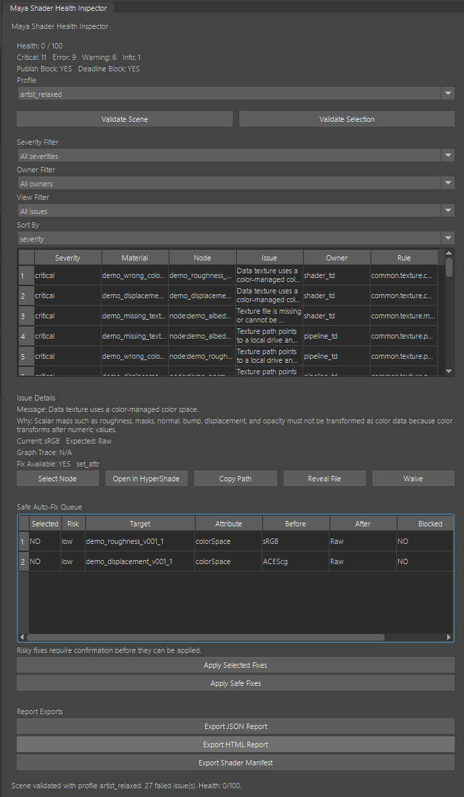
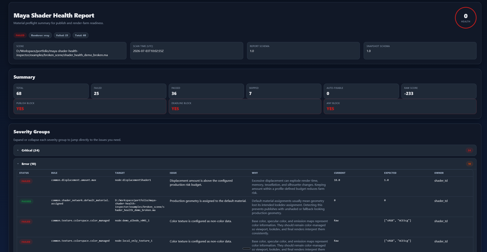
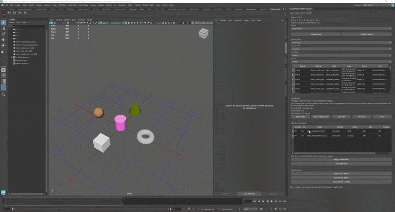
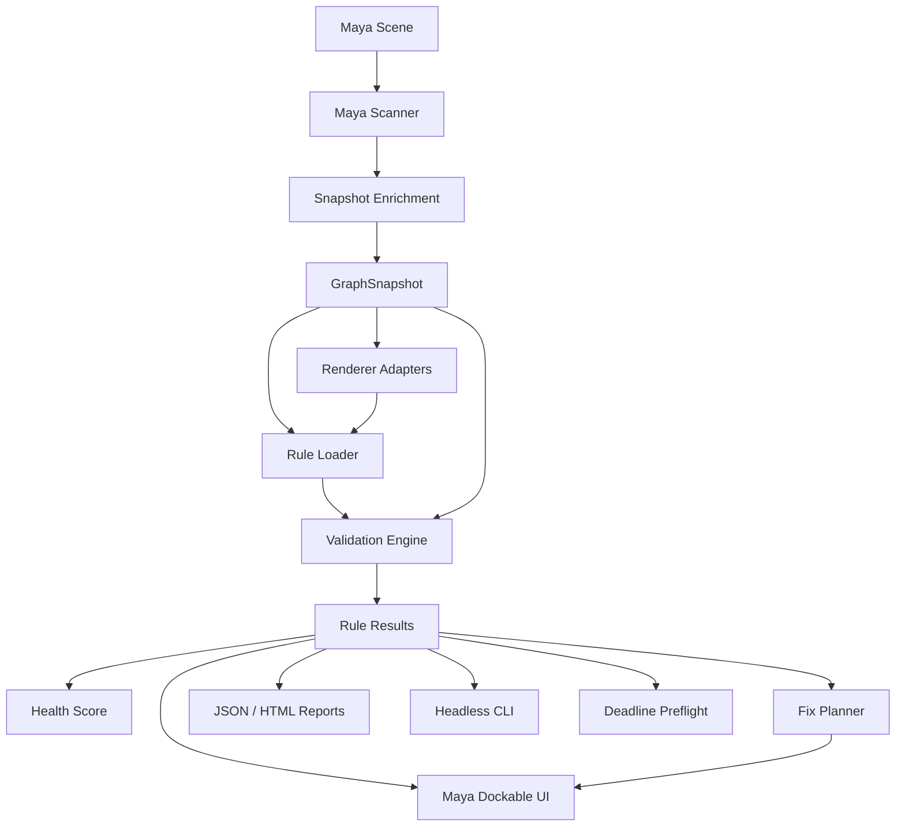

# Maya Shader Health Inspector

Production material QA framework for Maya pipelines.

Built to prevent render-time material failures by detecting missing textures, outdated maps, wrong color space, broken UDIMs, unsafe paths, displacement risk, and renderer-specific shader issues before assets reach publish or the render farm.

**Status:** **v0.4.0 shipped** (2026-07-08) — GUI-first Farm tab, Deadline 10 on-prem integration, render-risk depth, studio settings  
**Primary DCC:** Autodesk Maya  
**Initial renderer targets:** Common Maya, V-Ray, Arnold  
**Future renderer targets:** RenderMan, Redshift, USD / MaterialX

The tool answers one practical production question:

> Can this asset or shot be safely published or submitted to the render farm, and if not, what is broken, who owns the fix, how dangerous is it, and can it be fixed safely?

## Visual demo

Captured from [`examples/broken_scene/shader_health_demo_broken.ma`](examples/broken_scene/shader_health_demo_broken.ma). Full capture notes: [`docs/assets/README.md`](docs/assets/README.md).

### Dockable panel



The dockable Maya panel after **Validate Scene**: health score, severity filters, issue details, and the Safe Auto-Fix Queue on the broken demo scene.

### HTML report



Self-contained HTML export from the same demo validation. Severity groups collapse so reviewers can jump straight to the issue list they care about.

Sample artifacts:

- [Open HTML report](examples/broken_scene/shader_health_demo_broken_shader_health_report.html)
- [JSON report](examples/broken_scene/shader_health_demo_broken_shader_health_report.json)
- [Shader manifest](examples/broken_scene/shader_health_demo_broken_shader_health_manifest.json)

### Safe auto-fix (before / after)



A low-risk colorspace fix selected in the queue, applied with undo support, then re-validated until the issue clears.

## Architecture

Validation is snapshot-first: Maya scanning stays at the edge; rules, scoring, reports, and fix planning run on plain Python data so behavior is testable without Maya.



More detail: [`docs/ARCHITECTURE.md`](docs/ARCHITECTURE.md)

## Why this exists

Feature animation and VFX productions can accumulate hundreds of unique materials across characters, props, environments, crowds, and shot-level overrides. Common failures include:

- missing texture files;
- stale texture versions;
- wrong color space on data maps;
- broken UDIM tile sets;
- local artist paths that render farm machines cannot access;
- risky displacement settings;
- overly complex shader graphs;
- duplicate or orphan material networks;
- renderer plugin/version mismatch;
- referenced assets that cannot be safely modified in a shot scene.

These problems are often discovered too late: during farm submission, overnight rendering, lighting review, or final image QA. The goal of this project is to move material failure detection earlier in the pipeline.

## Core principles

- Data-driven validation rules.
- Renderer-agnostic core with renderer-specific adapters.
- Testable pure Python validation engine independent of Maya UI.
- Safe fixes only: previewable, undoable, and reference-aware.
- Explainable results: every issue must describe what is wrong, why it matters, and what should be done.
- Headless validation for publish systems, CI, and Deadline preflight.
- Dockable Maya UI for artists, Shader TDs, and supervisors.

## Demo scene

The v0.1 demo is a deliberately broken Maya scene with readable geometry and material names:

```text
examples/broken_scene/
├── shader_health_demo_broken.ma
├── textures/
└── README.md
```

Intentional issue categories:

- missing texture;
- wrong colorSpace;
- missing UDIM tile;
- local path;
- displacement risk;
- orphan material.

Build and validation steps: [`examples/broken_scene/README.md`](examples/broken_scene/README.md)

## Current capabilities (v0.4)

- Everything in v0.3, plus:
- **Deadline 10 on-prem** integration package + **Farm** tab (connection status, preflight, CommandScript submit).
- **Settings** screen with studio config (`shader_health_studio.json`): **Require .tx** and **Thinkbox Deadline** connector (**Remote Farm** toggle).
- Expanded render-risk rules: displacement depth, optimized texture / `.tx` policy, duplicate materials/textures.
- Native `.mll` plugin Phase 1 (CMake + ADR 0006); Python plug-in fallback unchanged.
- Maya integration CI smoke on self-hosted runners (`workflow_dispatch`).
- UX Wave 1: double-click issue → select node, Issue Details layout polish, GUI-first philosophy ([ADR 0005](docs/adr/0005-gui-first-product-philosophy.md)).

See [`CHANGELOG.md`](CHANGELOG.md) for the full v0.4.0 release notes.

## Current capabilities (v0.3)

- Everything in v0.2, plus:
- Manifest schema **1.1** with material graph fingerprints and regression gates (`shader_health gate`, `validate --baseline-manifest`).
- Headless `shader_health manifest` and `shader_health apply-fixes` (ADR 0004 policy).
- Texture resolution budgets by asset class (Hero / Prop / Background) in UI and CLI (`--asset-class-id`).
- Python MPx plugin dual install; **Compare to Approved Manifest**, **Publish Preflight**, and **Manifest Gate** UI shortcuts.
- Optional Maya CI manifest export + gate smoke (`workflow_dispatch`).

See [`CHANGELOG.md`](CHANGELOG.md) for the full v0.3.0 release notes.

## Current capabilities (v0.2)

- Everything in v0.1, plus:
- Safe fixes: `set_attr`, `relink_path`, `normalize_path`, `disable_feature` with audit log and fix-plan export.
- V-Ray and Arnold production policy rule packs with enriched snapshot metadata.
- Manifest diff (CLI + UI, JSON + HTML).
- Waiver manager UI, high-risk fix confirmation, reference-edit apply for referenced nodes.
- Publish preflight example, Maya install guide, studio overrides documentation.

See [`CHANGELOG.md`](CHANGELOG.md) for the full v0.2.0 release notes.

## Current capabilities (v0.1 baseline)

- `GraphSnapshot` model and Maya scanner.
- JSON rule schema, rule loader, and validation engine.
- Common Maya, V-Ray, and Arnold adapter foundation.
- Missing texture, path policy, UDIM, color space, and displacement checks.
- Material health score and severity summary.
- JSON / HTML reports and shader manifest export.
- Dockable Maya panel with issue table, filters, details, and safe fix queue.
- Headless validation command and Deadline preflight example.

Roadmap: [`docs/DEVELOPMENT_PLAN.md`](docs/DEVELOPMENT_PLAN.md) (§27) · v0.4 shipped · v0.3 plan in [`docs/V0_3_DEVELOPMENT_PLAN.md`](docs/V0_3_DEVELOPMENT_PLAN.md)

## Install in Maya

For studio rollout from the repository module layout or an editable `pip` install into `mayapy`, see [`docs/MAYA_INSTALL.md`](docs/MAYA_INSTALL.md).

Quick start with `MAYA_MODULE_PATH`:

```powershell
$env:MAYA_MODULE_PATH = "D:\tools\maya-shader-health-inspector\maya_module"
maya
```

Maya runs `maya_module/scripts/userSetup.py` at startup and installs the **Shader Health** menu plus **ShaderHealth** shelf button automatically.

## Development

### Requirements

- Python 3.9+
- Git
- Autodesk Maya is not required for pure Python core tests

### Editable install

```bash
python -m pip install --upgrade pip
python -m pip install -e ".[dev]"
```

Alternative using the dev requirements file:

```bash
python -m pip install -r requirements-dev.txt
```

### Run tests

```bash
python -m pytest tests -v
```

### Optional local checks

```bash
python -m ruff check src tests tools
python -m mypy src
python tools/validate_rules.py
```

### Source layout

```text
src/shader_health/
├── core/          # models, rules, validator, scoring, fix plan, reports
├── maya/          # scanner, commands, UI launcher, fix applier
├── ui/            # dockable panel widgets
├── adapters/      # renderer adapters and semantic slot resolver
├── rules/         # common / vray / arnold rule packs and profiles
└── deadline/      # submit preflight helpers
```

The package uses a `src` layout so imports during tests match installed-package behavior.

## Documentation

- [`docs/USER_GUIDE.md`](docs/USER_GUIDE.md) — intended artist/TD workflow
- [`docs/RULE_AUTHORING.md`](docs/RULE_AUTHORING.md) — rule pack authoring
- [`docs/SNAPSHOT_SCHEMA.md`](docs/SNAPSHOT_SCHEMA.md) — snapshot contract
- [`docs/integrations/deadline_submit_preflight.md`](docs/integrations/deadline_submit_preflight.md) — Deadline 10 on-prem integration guide (v0.4)
- [`docs/integrations/publish_submit_preflight.md`](docs/integrations/publish_submit_preflight.md) — publish preflight hook
- [`docs/MAYA_INSTALL.md`](docs/MAYA_INSTALL.md) — Maya module and `pip` install guide
- [`docs/STUDIO_OVERRIDES.md`](docs/STUDIO_OVERRIDES.md) — custom rules and profile overrides

## License

MIT License. See [`LICENSE`](LICENSE).
