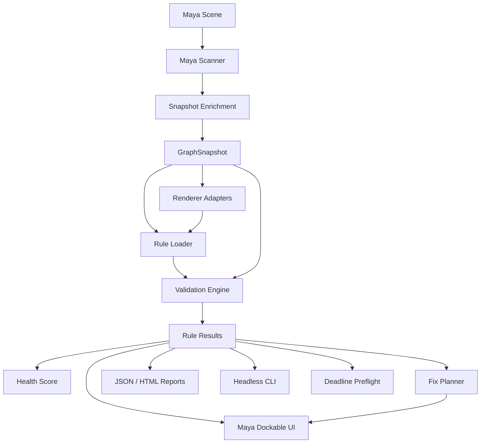

# Maya Pipeline Inspector

[](https://github.com/armasonix/maya-pipeline-inspector/actions/workflows/ci.yml)
[](LICENSE)
[](https://github.com/armasonix/maya-pipeline-inspector/releases)
[](https://www.python.org/)
[](docs/MAYA_INSTALL.md)

[](src/pipeline_inspector/rules/vray/)
[](src/pipeline_inspector/rules/arnold/)
[](docs/integrations/deadline_submit_preflight.md)
[](docs/integrations/tracker_publish.md)
[](docs/integrations/tracker_publish.md)
[](docs/integrations/slack_notifications.md)
[](docs/STUDIO_OVERRIDES.md)
[](docs/STUDIO_OVERRIDES.md)
[](docs/integrations/tracker_publish.md)

Production material and scene QA framework for Autodesk Maya pipelines ([`maya-pipeline-inspector`](https://github.com/armasonix/maya-pipeline-inspector)).

Built to prevent render-time failures by detecting missing textures, outdated maps, wrong color space, broken UDIMs, unsafe paths, displacement risk, geometry budget violations, duplicate meshes, and renderer-specific shader issues before assets reach publish or the render farm.

**Status:** **v0.6.0 shipped** (2026-07-21) · **v1.0+** on roadmap  
**Development honesty:** actively evolving — **v0.6.0** is the current public release; `dev` carries **v0.7+** work. Many surfaces remain **MVP-quality** — not a turnkey publish/AMS/farm stack. See [Known limitations & gaps](docs/USER_GUIDE.md#known-limitations--gaps) before production rollout.  
**Primary DCC:** Autodesk Maya · **Renderer rule packs:** Common Maya, V-Ray, Arnold · **Roadmap:** RenderMan, Redshift, USD / MaterialX

## Contents

- [Visual demo](#visual-demo)
- [Feature matrix](#feature-matrix)
- [Development status & limitations](#development-status--limitations)
- [Architecture](#architecture)
- [Why this exists](#why-this-exists)
- [Core principles](#core-principles)
- [Demo scenes](#demo-scenes)
- [What's shipping](#whats-shipping)
- [Install in Maya](#install-in-maya)
- [Development](#development)
- [Open source & community](#open-source--community) · [`COMMUNITY.md`](COMMUNITY.md)
- [Documentation](#documentation)
- [License](#license)

The tool answers one practical production question:

> Can this asset or shot be safely published or submitted to the render farm, and if not, what is broken, who owns the fix, how dangerous is it, and can it be fixed safely?

## Visual demo

Screenshots below are **representative UI captures**. For hands-on validation, open the **renderer policy demo scenes** ([V-Ray](#demo-scenes) · [Arnold](#demo-scenes)) — each scene targets one render engine and ships with pre-modeled material, path, and policy issues. Capture notes: [`docs/assets/README.md`](docs/assets/README.md).

### Dockable panel


The dockable Maya panel after **Validate Scene**: health score, severity filters, issue details, and the Safe Auto-Fix Queue on a policy demo scene.

### HTML report


Self-contained HTML export from validation. Severity groups collapse so reviewers can jump straight to the issue list they care about.

Sample reports (checked in beside each demo scene):

| Renderer | Scene | HTML report |
| --- | --- | --- |
| **V-Ray** | [`examples/vray_policy/vray_policy_scene.ma`](examples/vray_policy/vray_policy_scene.ma) | [Open HTML report](examples/vray_policy/reports/validation/vray_policy_scene_pipeline_inspector_report.html) |
| **Arnold** | [`examples/arnold_policy/arnold_policy_scene.ma`](examples/arnold_policy/arnold_policy_scene.ma) | [Open HTML report](examples/arnold_policy/reports/validation/arnold_policy_scene_pipeline_inspector_report.html) |

Load the matching renderer plug-in in Maya before **Validate Scene** so renderer-specific rules (`vray.*` / `arnold.*`) evaluate correctly.

### Safe auto-fix (before / after)


A low-risk colorspace fix selected in the queue, applied with undo support, then re-validated until the issue clears.

## Feature matrix

| Capability | v0.1 | v0.2 | v0.3 | v0.4 | v0.5 | v0.6 |
| --- | :---: | :---: | :---: | :---: | :---: | :---: |
| Material validation & health score | ✓ | ✓ | ✓ | ✓ | ✓ | ✓ |
| Safe auto-fix queue | | ✓ | ✓ | ✓ | ✓ | ✓ |
| Manifest export, diff & regression gates | | | ✓ | ✓ | ✓ | ✓ |
| Deadline Farm tab & preflight | | | | ✓ | ✓ | ✓ |
| Settings hub, notifications & trackers | | | | | ✓ | ✓ |
| Rule authoring & incident-to-rule | | | | | ✓ | ✓ |
| Geometry polycount & duplicate mesh checks | | | | | | ✓ |
| Machine Readiness tab | | | | | | ✓ |
| Role-based permissions ([ADR 0008](docs/adr/0008-role-based-governance-foundation.md)) | | | | | | ✓ |

See [`CHANGELOG.md`](CHANGELOG.md) for release-by-release detail.

## Development status & limitations

Maya Pipeline Inspector is **under active development** beyond each tagged release. **v0.6.0** is the current public release; the `dev` branch may contain incomplete **v0.7+** work.

**What to expect today**

| Area | Reality check |
| --- | --- |
| **Maturity** | Beta-stage tooling. Rule packs, connectors, and panel workflows work in maintainer-tested scenarios; edge cases in large production scenes are still being discovered. |
| **Maya coverage** | Maintainer-tested on Maya **2024–2025** only. **2026** is best-effort; **2023 and earlier** are outside the support matrix ([MAYA_INSTALL.md](docs/MAYA_INSTALL.md)). |
| **CI vs Maya** | Public CI runs **pure Python tests without Maya**. Real `mayapy` / panel smoke requires a **self-hosted runner** — regressions can slip through until someone runs Maya integration locally. |
| **Renderers** | Production rule packs target **Common Maya, V-Ray, Arnold**. RenderMan, Redshift, and USD/MaterialX inspection remain **roadmap**, not shipped adapters. |
| **Headless parity** | CLI loads `--studio-config`, but **does not load `user.json`** — assigned role, theme, and other user prefs differ from the panel unless you mirror policy in studio config. |
| **Roles & governance** | v0.6 role gates are a **foundation**: user-assigned roles are **self-reported** until tracker mapping is hardened ([ADR 0008](docs/adr/0008-role-based-governance-foundation.md)). |
| **Connectors** | Telegram, Discord, Slack, Ftrack, ShotGrid, Cerebro, Deadline, and bug-report relay require **studio wiring**, credentials, and network paths. Cerebro has **no HTML attachment** upload. **Bug Report:** public relay → upstream maintainers; **private relay** → your R&D when you fork or develop the plugin in-house ([bug_report_relay.md](docs/integrations/bug_report_relay.md#why-a-studio-private-relay)). |
| **Auto-update** | In-app update works for **`MAYA_MODULE_PATH` checkouts only** — not for editable `pip` installs ([auto_update.md](docs/integrations/auto_update.md)). |
| **Rule authoring** | Rule browser / incident-to-rule wizard is **MVP**; advanced checks still need hand-edited JSON ([RULE_AUTHORING.md](docs/RULE_AUTHORING.md)). |
| **Validation accuracy** | Texture version freshness is **filesystem-only** (no publish DB / AMS). Farm cost score is a **heuristic**, not measured render time. Geometry duplicate scans may **truncate** on very large scenes. |
| **Safe fixes** | Only a **subset** of failed rules offer auto-fix. Referenced nodes, high-risk edits, and studio-specific policy still need manual work. |
| **Deadline** | Targets **Thinkbox Deadline 10 on-prem** via Web Service. Not a full render-manager replacement; farm submit queues **utility validation jobs**, not beauty render jobs. |
| **Next on `dev`** | **v0.7+** — headless parity, governance audit export, readiness CLI, connector reliability ([DEVELOPMENT_PLAN §14](docs/DEVELOPMENT_PLAN.md#14-roadmap--strengthen-and-extend)). |

Full user-facing list: [USER_GUIDE — Known limitations & gaps](docs/USER_GUIDE.md#known-limitations--gaps).

## Architecture

Validation is snapshot-first: Maya scanning stays at the edge; rules, scoring, reports, and fix planning run on plain Python data so behavior is testable without Maya.



More detail: [`docs/ARCHITECTURE.md`](docs/ARCHITECTURE.md)

## Why this exists

Feature animation and VFX productions can accumulate hundreds of unique materials across characters, props, environments, crowds, and shot-level overrides. Common failures include:

- missing texture files;
- stale texture versions;
- wrong color space on data maps;
- broken UDIM tile sets;
- local workstation paths that render farm machines cannot access;
- risky displacement settings;
- overly complex shader graphs;
- duplicate or orphan material networks;
- renderer plugin/version mismatch;
- referenced assets that cannot be safely modified in a shot scene.

These problems are often discovered too late: during farm submission, overnight rendering, lighting review, or final image QA. The goal of this project is to move material failure detection earlier in the pipeline.

## Core principles

- Data-driven validation rules.
- Renderer-agnostic core with renderer-specific adapters.
- Testable pure Python validation engine independent of Maya UI.
- Safe fixes only: previewable, undoable, and reference-aware.
- Explainable results: every issue must describe what is wrong, why it matters, and what should be done.
- Headless validation for publish systems, CI, and Deadline preflight.
- Dockable Maya UI for Technical Artists, Shader TDs, and Supervisors.

## Demo scenes

Policy demo scenes are **deliberately broken** Maya scenes with readable geometry and material names. Each targets **one render engine** and exercises **common** plus **renderer-specific** rule packs with **pre-modeled problems** — not a beauty render setup.

```text
examples/
├── vray_policy/
│   ├── vray_policy_scene.ma
│   └── reports/validation/
└── arnold_policy/
    ├── arnold_policy_scene.ma
    └── reports/validation/
```

| Scene | Renderer | Load in Maya | What it demonstrates |
| --- | --- | --- | --- |
| [`vray_policy_scene.ma`](examples/vray_policy/vray_policy_scene.ma) | **V-Ray** | V-Ray plug-in + scene | Missing textures, UDIM gaps, local/user paths, wrong colorspace, displacement risk; **`vray.scene.plugin_missing`**, trace depth, force displacement, displacement review, texture budgets |
| [`arnold_policy_scene.ma`](examples/arnold_policy/arnold_policy_scene.ma) | **Arnold** | Arnold plug-in + scene | Same common texture/path issues; **`arnold.scene.plugin_missing`**, transmission depth, texture budgets, displacement review; geometry duplicate-scan metadata (v0.6) |

Shared **common** issue categories in both scenes:

- missing or broken texture paths;
- wrong color space on data vs color maps;
- incomplete UDIM tile sets;
- local drive / user-folder paths unsafe for farm;
- displacement-linked materials needing review;
- orphan or default-material assignments (where modeled).

**How to try**

1. Set `MAYA_MODULE_PATH` (see [Install in Maya](#install-in-maya)) and launch Maya.
2. Open the scene for your renderer and **load the matching plug-in**.
3. Open **Pipeline Inspector** → **Validate Scene** (try `publish_strict` or `deadline_critical`).
4. Compare with the checked-in HTML under `examples/*/reports/validation/`.

Per-scene notes: [`examples/vray_policy/README.md`](examples/vray_policy/README.md) · [`examples/arnold_policy/README.md`](examples/arnold_policy/README.md)

## What's shipping

| Milestone | State | Highlights |
| --- | --- | --- |
| **v0.6.0** | Released 2026-07-21 | Geometry QA, Machine Readiness tab, role governance ([ADR 0008](docs/adr/0008-role-based-governance-foundation.md)), supervisor routing, farm analytics CLI |
| **v0.5.0** | Released 2026-07-12 | Settings hub, Telegram/Discord/Slack, Ftrack/ShotGrid/Cerebro, rule authoring MVP, auto-update, bug-report relay |
| **v0.4.0** | Released | Deadline 10 Farm tab, studio config, native `.mll` Phase 1, GUI-first UX wave |
| **v0.3.0** | Released | Manifest gates, headless apply-fixes, asset-class texture budgets |
| **v0.2.0** | Released | Safe fixes, V-Ray/Arnold policy packs, manifest diff, waivers |
| **v0.1.0** | Released | Snapshot-first core, panel, CLI, common material rules |

Release notes: [`CHANGELOG.md`](CHANGELOG.md) · Feature matrix above · Roadmap: [`docs/DEVELOPMENT_PLAN.md`](docs/DEVELOPMENT_PLAN.md)

## Install in Maya

For studio rollout from the repository module layout or an editable `pip` install into `mayapy`, see [`docs/MAYA_INSTALL.md`](docs/MAYA_INSTALL.md).

Quick start with `MAYA_MODULE_PATH`:

```powershell
$env:MAYA_MODULE_PATH = "D:\tools\maya-pipeline-inspector\maya_module"
maya
```

Maya runs `maya_module/scripts/userSetup.py` at startup and installs the **Pipeline Inspector** menu plus **PipelineInspector** shelf button automatically.

## Development

Contributor setup, branch workflow, and PR expectations: [`CONTRIBUTING.md`](CONTRIBUTING.md).

### Requirements

- Python 3.9+
- Git
- Autodesk Maya is not required for pure Python core tests

### Editable install

```bash
python -m pip install --upgrade pip
python -m pip install -e ".[dev]"
```

Alternative using the dev requirements file:

```bash
python -m pip install -r requirements-dev.txt
```

### Run tests

```bash
python -m pytest tests -v
```

### Optional local checks

```bash
python -m ruff check src tests tools
python -m mypy src
python tools/validate_rules.py
```

### Source layout

```text
src/pipeline_inspector/
├── core/          # models, rules, validator, scoring, fix plan, reports
├── maya/          # scanner, commands, UI launcher, fix applier
├── ui/            # dockable panel widgets
├── adapters/      # renderer adapters and semantic slot resolver
├── rules/         # common / vray / arnold rule packs and profiles
└── deadline/      # submit preflight helpers
```

The package uses a `src` layout so imports during tests match installed-package behavior.

## Open source & community

**Maya Pipeline Inspector is an MIT-licensed open-source project.** The goal is not a closed studio script — it is a **shared production QA layer** for Maya pipelines that studios, TDs, and Technical Artists can extend together: common rule schema, renderer adapters, integration guides, and sanitized demo scenes that feed back upstream. See [`COMMUNITY.md`](COMMUNITY.md).

| If you want to… | Start here |
| --- | --- |
| **Browse the full wiki (KB, tutorials, reference)** | **[`docs/wiki/Home.md`](docs/wiki/Home.md)** |
| Report a bug or request a rule | [GitHub Issues](https://github.com/armasonix/maya-pipeline-inspector/issues) |
| Discuss design or studio rollout | [GitHub Discussions](https://github.com/armasonix/maya-pipeline-inspector/discussions) · [`COMMUNITY.md`](COMMUNITY.md) |
| Contribute code, rules, or docs | [`CONTRIBUTING.md`](CONTRIBUTING.md) · [`COMMUNITY.md`](COMMUNITY.md) |
| Propose a rule pack or profile change | [`docs/RULE_AUTHORING.md`](docs/RULE_AUTHORING.md) + an issue with fixture ideas |
| Add or extend a renderer adapter | [`src/pipeline_inspector/adapters/`](src/pipeline_inspector/adapters/) + [`CONTRIBUTING.md`](CONTRIBUTING.md#renderer-adapter-contribution-guidelines) |
| Share a studio integration pattern | `examples/` or `docs/integrations/` PR (sanitized paths only) |
| Report a plugin defect from Maya | Panel **Bug Report** or [`docs/integrations/bug_report_relay.md`](docs/integrations/bug_report_relay.md) |

Studios running a fork or internal rollout are welcome to open an issue or discussion if you want to be listed as an early adopter (optional, no commitment).

## Documentation

| Guide | Audience |
| --- | --- |
| **[`docs/wiki/Home.md`](docs/wiki/Home.md)** | **Everyone — wiki KB, tutorials, panel guides, FAQ** |
| [`COMMUNITY.md`](COMMUNITY.md) | Community — channels, early adopters, how to help |
| [`CONTRIBUTING.md`](CONTRIBUTING.md) | Contributors — code, rules, adapters, docs |
| [`docs/USER_GUIDE.md`](docs/USER_GUIDE.md) | Technical Artists, Shader TDs, Supervisors |
| [`docs/MAYA_INSTALL.md`](docs/MAYA_INSTALL.md) | Pipeline TDs rolling out `maya_module` or `pip` |
| [`docs/STUDIO_OVERRIDES.md`](docs/STUDIO_OVERRIDES.md) | Studio rule packs, profiles, `pipeline_inspector_studio.json` |
| [`docs/ARCHITECTURE.md`](docs/ARCHITECTURE.md) | Contributors — snapshot-first design and v0.6 subsystems |
| [`docs/RULE_AUTHORING.md`](docs/RULE_AUTHORING.md) | Rule pack authoring |
| [`docs/SNAPSHOT_SCHEMA.md`](docs/SNAPSHOT_SCHEMA.md) | `GraphSnapshot` contract |

Integration guides (consistent studio rollout style):

- [`docs/integrations/deadline_submit_preflight.md`](docs/integrations/deadline_submit_preflight.md) — Deadline 10 Web Service, Farm tab
- [`docs/integrations/deadline_farm_analytics.md`](docs/integrations/deadline_farm_analytics.md) — farm throughput / failure analytics
- [`docs/integrations/publish_submit_preflight.md`](docs/integrations/publish_submit_preflight.md) — publish gate hook
- [`docs/integrations/slack_notifications.md`](docs/integrations/slack_notifications.md) — Slack webhook routing
- [`docs/integrations/tracker_publish.md`](docs/integrations/tracker_publish.md) — Ftrack / ShotGrid / Cerebro publish
- [`docs/integrations/auto_update.md`](docs/integrations/auto_update.md) — Check for Updates wizard
- [`docs/integrations/bug_report_relay.md`](docs/integrations/bug_report_relay.md) — maintainer bug-report relay

## License

MIT License — use, fork, and extend in your studio pipeline. See [`LICENSE`](LICENSE).
