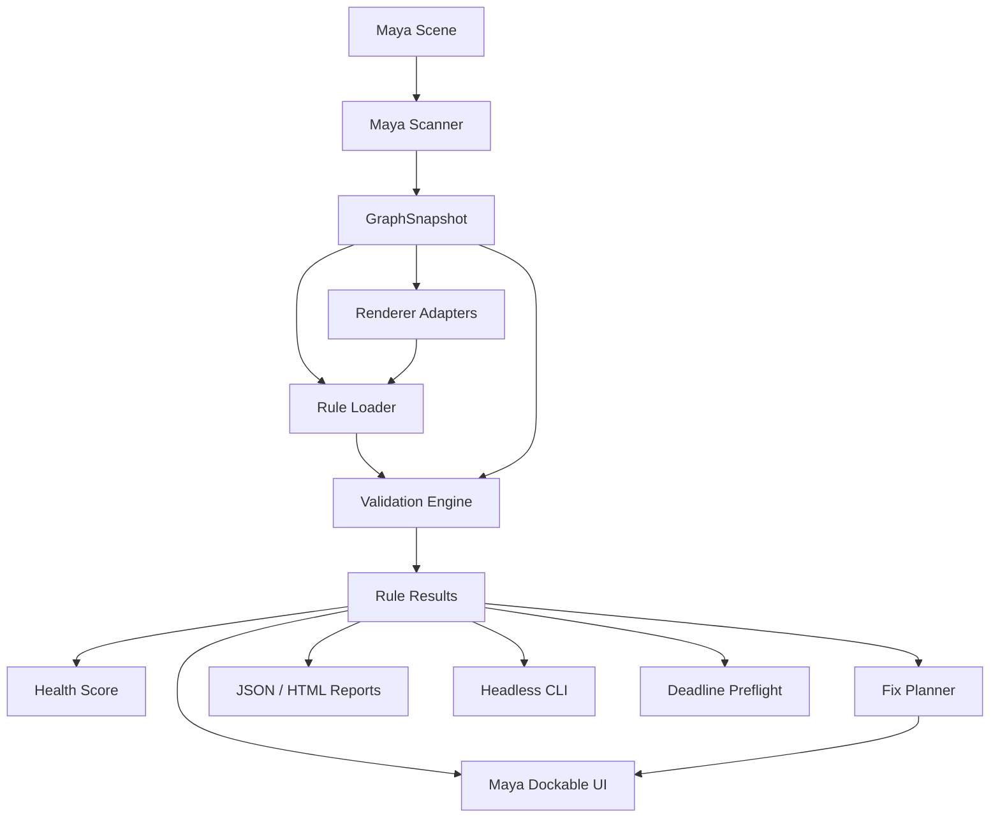
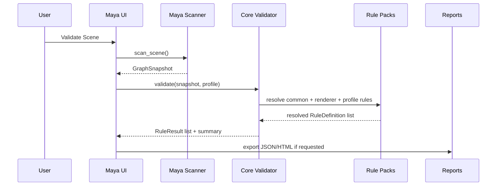

# Architecture

Maya Shader Health Inspector is designed as a data-driven Maya material QA framework with a testable pure Python core and thin Maya integration layers.

Status: early development. This document defines the intended architecture and will evolve as implementation progresses.

## Goals

- Keep validation logic independent from Maya UI.
- Keep renderer-specific behavior outside the core engine.
- Make rules, profiles, block policies, ownership, and safe fixes data-driven.
- Support headless validation for publish hooks, CI-like checks, and Deadline preflight.
- Keep scene mutation safe, explicit, undoable, and reference-aware.

## High-level Layers

```text
Maya scene
  -> Maya scanner
  -> GraphSnapshot
  -> Renderer adapter resolution
  -> Rule pack resolution
  -> Core validation engine
  -> RuleResult list
  -> Health score
  -> Fix plan
  -> UI / JSON report / HTML report / headless exit code / Deadline hook
```

## Component Overview



## Core Principle: Snapshot First

The Maya-dependent scanner creates a renderer-agnostic `GraphSnapshot`. The core validator only consumes plain Python objects or JSON-compatible dictionaries. This allows most behavior to be tested with pytest without launching Maya.

Benefits:

- fast unit tests;
- deterministic fixtures;
- easier renderer adapter testing;
- headless validation parity;
- reduced Maya API coupling.

## Package Layout

Target structure:

```text
src/shader_health/
├── core/
│   ├── models.py
│   ├── rule_schema.py
│   ├── rule_loader.py
│   ├── validator.py
│   ├── scoring.py
│   ├── waivers.py
│   ├── fix_plan.py
│   ├── reports.py
│   ├── manifest.py
│   └── diff.py
├── maya/
│   ├── scanner.py
│   ├── graph_trace.py
│   ├── selection.py
│   ├── fix_applier.py
│   ├── reference_safety.py
│   ├── ui_launcher.py
│   └── commands.py
├── ui/
│   ├── main_window.py
│   ├── models.py
│   ├── delegates.py
│   ├── widgets.py
│   └── styles.qss
├── adapters/
│   ├── base.py
│   ├── common_maya.py
│   ├── vray.py
│   └── arnold.py
├── rules/
│   ├── common/
│   ├── vray/
│   ├── arnold/
│   └── profiles/
├── deadline/
│   └── submit_preflight.py
└── utils/
```

## Data Flow



## Main Data Contracts

### GraphSnapshot

Represents a scene, selection, or asset in a Maya-independent form.

Expected contents:

- scene metadata;
- renderer family;
- nodes;
- connections;
- materials;
- shading engines;
- file dependencies;
- references;
- scan scope.

### RuleDefinition

Data-driven validation rule loaded from JSON.

Required concepts:

- stable rule ID;
- severity;
- owner;
- message;
- why;
- match criteria;
- check definition;
- block policy;
- optional fix definition.

### RuleResult

Validation result returned by the core engine.

Expected contents:

- rule ID;
- status: passed, failed, skipped, waived;
- severity;
- material/node/plug target;
- message and why;
- current and expected value;
- publish/deadline block flags;
- auto-fix availability;
- evidence and graph trace.

## Renderer Adapter Boundary

Renderer adapters classify renderer-specific nodes and plug semantics. The core engine must not hardcode V-Ray or Arnold node knowledge.

Adapter responsibilities:

- detect supported node types;
- classify material and texture nodes;
- define semantic texture slots;
- define displacement slots;
- provide complexity weights;
- expose default rule packs.

Initial adapters:

- Common Maya;
- V-Ray;
- Arnold.

Future adapters:

- RenderMan;
- Redshift;
- USD / MaterialX inspection.

## Rule Pack Resolution

Rules should load in deterministic order:

```text
common rules
-> renderer rules
-> studio/show overrides
-> selected profile overrides
-> user/session overrides
```

Profiles may change severity, block flags, thresholds, and enabled state. Rule IDs must remain stable.

## Safety Model

The tool must be non-destructive by default.

Safe-fix rules:

- no silent scene mutation;
- all fixes are previewed;
- fixes are applied inside Maya undo chunks;
- referenced and locked nodes are blocked by default;
- high-risk fixes require explicit confirmation;
- before/after values are recorded.

## Headless Parity

Anything important in the UI should also be available in headless mode through snapshot validation and deterministic reports.

Target command shape:

```bash
mayapy -m shader_health validate scene.ma --profile publish_strict --report report.json
```

## Testing Strategy

Default public CI should run pure Python tests only:

- model serialization tests;
- rule schema tests;
- rule loader tests;
- validator tests;
- scoring tests;
- path/UDIM/version parsing tests;
- report and manifest tests.

Maya integration tests should be optional/local unless Maya is available.

## Development Rule

Do not build UI logic around unstable models. Implement and test the core snapshot/rule/result contracts before expanding scanner, adapters, UI, and fixes.
