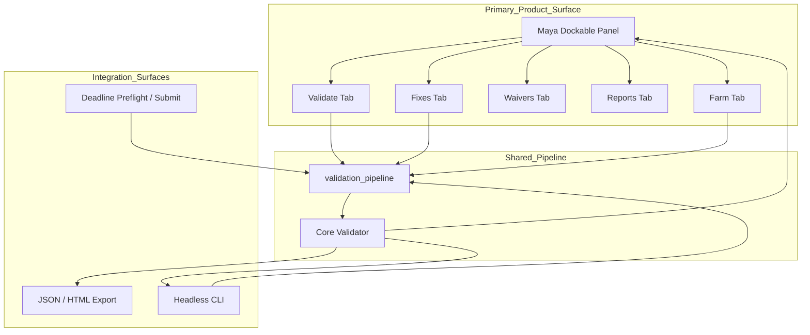
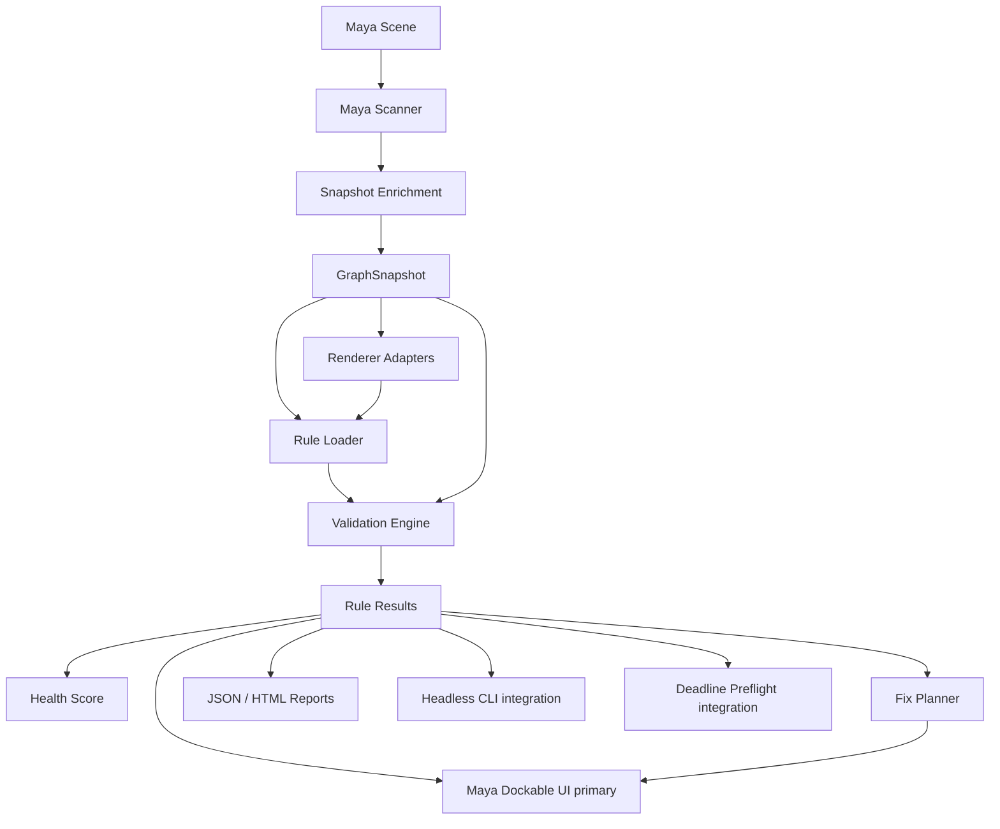
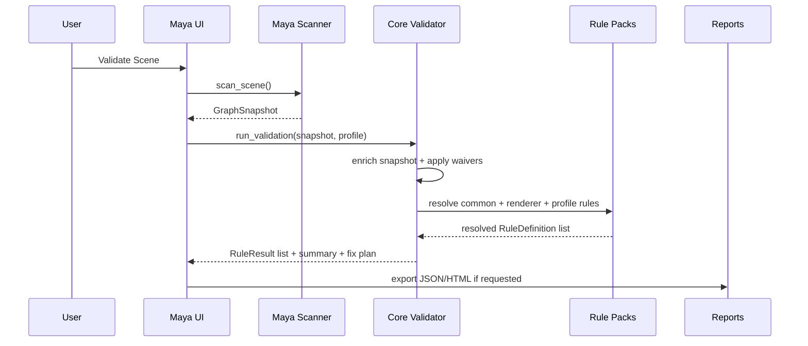

# Architecture

**Product:** Maya Pipeline Inspector (`maya-pipeline-inspector`)

Maya Pipeline Inspector is designed as a data-driven Maya material and scene QA framework with a testable pure Python core and thin Maya integration layers.

**Status:** v0.5.0 shipped (2026-07-12) · v0.6 in development on `dev`  
**Related:** [USER_GUIDE.md](USER_GUIDE.md) · [MAYA_INSTALL.md](MAYA_INSTALL.md) · [STUDIO_OVERRIDES.md](STUDIO_OVERRIDES.md)

GUI-first product philosophy ([ADR 0005](adr/0005-gui-first-product-philosophy.md)); settings and connectors hub ([ADR 0007](adr/0007-settings-and-connectors-architecture.md)); native Maya plugin bootstrap strategy ([ADR 0006](adr/0006-native-mll-plugin-strategy.md)): thin C++ `.mll` delegates to Python, with `.py` plug-in fallback. Role governance ([ADR 0008](adr/0008-role-based-governance-foundation.md)) gates risky actions in v0.6+. The Maya dockable panel is the primary surface; CLI, reports, Deadline, readiness checks, notifications, and tracker hooks are integration surfaces on the same validation pipeline.

> **Implementation reality:** architecture describes target design. Gaps between panel and CLI, incomplete adapter coverage, and MVP connectors are documented in [USER_GUIDE.md — Known limitations & gaps](USER_GUIDE.md#known-limitations--gaps).

## Goals

- Keep validation logic independent from Maya UI.
- Keep renderer-specific behavior outside the core engine.
- Make rules, profiles, block policies, ownership, and safe fixes data-driven.
- Support headless validation for publish hooks, CI-like checks, and Deadline preflight.
- Keep scene mutation safe, explicit, undoable, and reference-aware.
- Treat the Maya dockable panel as the primary product surface; keep CLI and farm paths on the same pipeline (ADR 0005).

## Product Surface (ADR 0005)

Contributors should implement behavior in the shared validation pipeline first, then expose it in the dockable panel. Headless CLI, JSON/HTML reports, manifest export, apply-fixes, and Deadline integration call the same modules — they do not fork validation logic.

```text
Primary surface (Technical Artists / Shader TDs)
  Maya dockable UI  ->  ui_launcher  ->  validation_pipeline  ->  core engine

Integration surfaces (pipeline TDs / farm / CI)
  CLI / mayapy  ->  validation_pipeline  ->  core engine
  Deadline hook / Farm tab  ->  integrations.deadline  ->  validation_pipeline
```

See [integrations/deadline_submit_preflight.md](integrations/deadline_submit_preflight.md) for the v0.4 Deadline 10 studio guide (Web Service, pool/group routing, GUI + headless flows).

Design constraints for panel work:

- default flows: three clicks or fewer to an actionable validate/fix/submit result;
- `block_publish` and `block_deadline` visible in panel summary without opening JSON;
- safe actions avoid modal spam; risky fixes stay gated per ADR 0003/0004.

## High-level Layers

```text
Maya scene
  -> Maya scanner
  -> Snapshot enrichment
  -> GraphSnapshot
  -> Renderer adapter resolution
  -> Rule pack resolution
  -> Core validation engine
  -> Waiver application
  -> Result enrichment
  -> RuleResult list
  -> Health score
  -> Fix plan
  -> Maya dockable UI (primary)
  -> JSON report / HTML report / headless CLI / Deadline hook (integration)
```

## UX Layer (panel)

The dockable panel (`pipeline_inspector.ui.main_window`, launched via `pipeline_inspector.maya.ui_launcher`) is the primary Technical Artist-facing surface. Tabs group routine tasks; callbacks delegate to `validation_pipeline` and `pipeline_inspector.integrations.deadline` — no duplicated rule evaluation in widgets.



## Maya Plugin Delivery (ADR 0006)

Maya integration uses a **thin native bootstrap** plus **Python implementation**. The compiled plug-in (`.mll` / `.so` / `.bundle`) exists only to register with Maya and call existing Python bootstrap code; validation, UI, and rules stay in `src/pipeline_inspector/`.

```text
maya_module/
  scripts/userSetup.py          # deferred startup; year-aware load order
  scripts/pipeline_inspector_bootstrap.py
  plug-ins/
    {2024,2025,2026}/pipeline_inspector.mll   # preferred when built (#096–#097)
    pipeline_inspector.py                     # OpenMayaMPx fallback (v0.3+)
        |
        v
  pipeline_inspector.maya.commands / ui_launcher / validation_pipeline
        |
        v
  src/pipeline_inspector/ (core + maya + ui)
```

Load priority: **native `.mll` for current Maya year → `.py` plugin → direct `install_ui()`**. Open-source checkouts without compiled binaries continue to work via the `.py` path.

Build matrix and devkit requirements: [ADR 0006](adr/0006-native-mll-plugin-strategy.md).

## Component Overview



## Core Principle: Snapshot First

The Maya-dependent scanner creates a renderer-agnostic `GraphSnapshot`. The core validator only consumes plain Python objects or JSON-compatible dictionaries. This allows most behavior to be tested with pytest without launching Maya.

Benefits:

- fast unit tests;
- deterministic fixtures;
- easier renderer adapter testing;
- headless validation parity;
- reduced Maya API coupling.

## v0.6 subsystems

### Geometry validation

Geometry checks extend the snapshot-first model beyond materials:

- Maya scanner and enrichment populate `ShapeSnapshot` entries on `GraphSnapshot`.
- Rules in `rules/common/geometry_polycount.json` and `rules/common/duplicate_geometry.json` use `scope: geometry`.
- Check types `duplicate_geometry` and `duplicate_geometry_scan_budget` live in `core/rule_schema.py`; large scenes honor a scan budget with truncated evidence.
- Asset-class profile overlays (`asset_class_hero`, `asset_class_prop`, `asset_class_background`) tighten polycount thresholds per tier.

Geometry failures participate in the same severity, blocking, waiver, and report flows as material rules.

### Machine readiness

The **Readiness** panel tab validates workstation prerequisites before Technical Artists publish or submit to farm:

```text
studio_config.readiness.checks
  -> integrations/readiness/engine.py (run_readiness_checks)
  -> integrations/readiness/probes.py (Maya plugins, drives, env, paths, software)
  -> Readiness tab UI (readiness_tab.py)
  -> optional notification connectors (sysadmin / support escalation)
```

Readiness is Maya-adjacent (live probes) but configuration-driven and testable with injected probes. It does not mutate the scene.

### Role governance

`core/governance.py` exposes `PermissionResolver`, which resolves an effective pipeline role from studio policy, tracker env mapping, user preference, or default, then enforces a capability matrix:

| Capability | Typical gate |
| --- | --- |
| `apply_risky_fixes` | High-risk fix apply, CLI `--allow-high-risk` |
| `submit_farm` | Farm tab **Submit to Farm** |
| `manage_rules` | Extra rule paths, CLI `--extra-rules` |
| `edit_studio_settings` / `edit_connectors` | Settings **Save Studio Config** |

Denied actions return a human-readable reason with effective role and role source. See [ADR 0008](adr/0008-role-based-governance-foundation.md) and [STUDIO_OVERRIDES.md](STUDIO_OVERRIDES.md#governance-and-role-assignment-v06).

## Package Layout

Target structure:

```text
src/pipeline_inspector/
├── core/
│   ├── models.py
│   ├── rule_schema.py
│   ├── rule_loader.py
│   ├── validator.py
│   ├── scoring.py
│   ├── waivers.py
│   ├── fix_plan.py
│   ├── reports.py
│   ├── manifest.py
│   ├── diff.py
│   └── governance.py          # PermissionResolver (v0.6)
├── maya/
│   ├── scanner.py
│   ├── snapshot_enrichment.py
│   ├── validation_pipeline.py
│   ├── graph_trace.py
│   ├── selection.py
│   ├── fix_applier.py
│   ├── reference_safety.py
│   ├── readiness_actions.py   # Readiness tab Maya hooks (v0.6)
│   ├── ui_launcher.py
│   └── commands.py
├── ui/
│   ├── main_window.py
│   ├── readiness_tab.py       # Machine Readiness tab (v0.6)
│   ├── models.py
│   ├── delegates.py
│   ├── widgets.py
│   └── styles.qss
├── integrations/
│   ├── readiness/             # Probe engine + installed software checks
│   ├── deadline/
│   ├── trackers/
│   └── update/
├── adapters/
│   ├── base.py
│   ├── common_maya.py
│   ├── vray.py
│   └── arnold.py
├── rules/
│   ├── common/                # includes geometry_polycount, duplicate_geometry
│   ├── vray/
│   ├── arnold/
│   └── profiles/
├── deadline/
│   └── submit_preflight.py
└── utils/
```

## Data Flow



## Main Data Contracts

### GraphSnapshot

Represents a scene, selection, or asset in a Maya-independent form.

Expected contents:

- scene metadata;
- renderer family;
- nodes;
- connections;
- materials;
- shading engines;
- shapes and geometry metadata (v0.6+);
- file dependencies;
- references;
- scan scope.

### RuleDefinition

Data-driven validation rule loaded from JSON.

Required concepts:

- stable rule ID;
- severity;
- owner;
- message;
- why;
- match criteria;
- check definition;
- block policy;
- optional fix definition.

### RuleResult

Validation result returned by the core engine.

Expected contents:

- rule ID;
- status: passed, failed, skipped, waived;
- severity;
- material/node/plug target;
- message and why;
- current and expected value;
- publish/deadline block flags;
- auto-fix availability;
- evidence and graph trace.

## Renderer Adapter Boundary

Renderer adapters classify renderer-specific nodes and plug semantics. The core engine must not hardcode V-Ray or Arnold node knowledge.

Adapter responsibilities:

- detect supported node types;
- classify material and texture nodes;
- define semantic texture slots;
- define displacement slots;
- provide complexity weights;
- expose default rule packs.

Initial adapters:

- Common Maya;
- V-Ray;
- Arnold.

Future adapters:

- RenderMan;
- Redshift;
- USD / MaterialX inspection.

## Rule Pack Resolution

Rules should load in deterministic order:

```text
common rules
-> renderer rules
-> studio/show overrides
-> selected profile overrides
-> user/session overrides
```

Profiles may change severity, block flags, thresholds, and enabled state. Rule IDs must remain stable.

## Safety Model

The tool must be non-destructive by default.

Safe-fix rules:

- no silent scene mutation;
- all fixes are previewed;
- fixes are applied inside Maya undo chunks;
- referenced and locked nodes are blocked by default;
- high-risk fixes require explicit confirmation;
- before/after values are recorded.

## Headless Parity

UI and CLI both call `pipeline_inspector.maya.validation_pipeline.run_validation`, which runs snapshot enrichment, profile resolution, waiver loading, result enrichment, and fix planning in one shared path. ADR 0005 defines the panel as the primary product surface; headless and farm paths are integration surfaces on this same pipeline — not alternate implementations.

```bash
python -m pipeline_inspector validate scene.ma --profile-id publish_strict --report report.json
```

## Testing Strategy

Default public CI runs pure Python tests only:

- model serialization tests;
- rule schema and loader tests;
- validator and scoring tests;
- snapshot enrichment and validation pipeline parity tests;
- report and manifest tests;
- Maya UI launcher tests with Qt/Maya mocked.

Maya integration tests are optional/local unless Maya is available.

## Development Rule

Extend the shared validation pipeline and snapshot contracts before adding UI-only behavior. Keep headless and UI entrypoints on the same enrichment path. New v0.4+ features should add a panel affordance before (or alongside) CLI-only delivery ([ADR 0005](adr/0005-gui-first-product-philosophy.md)).
