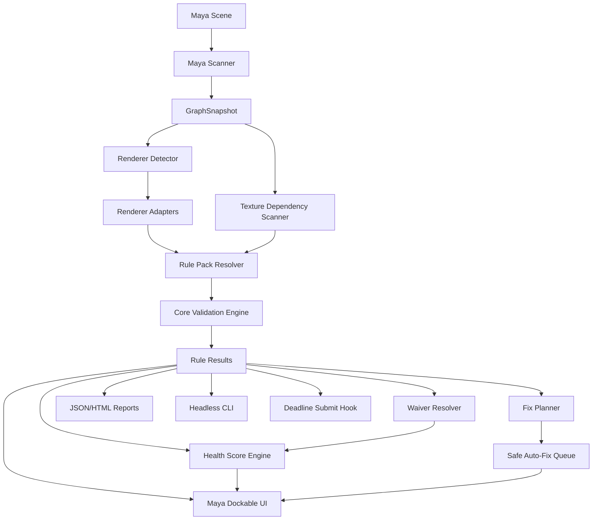
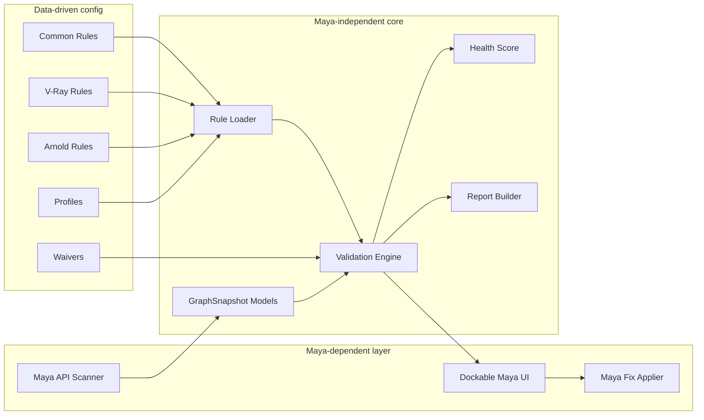
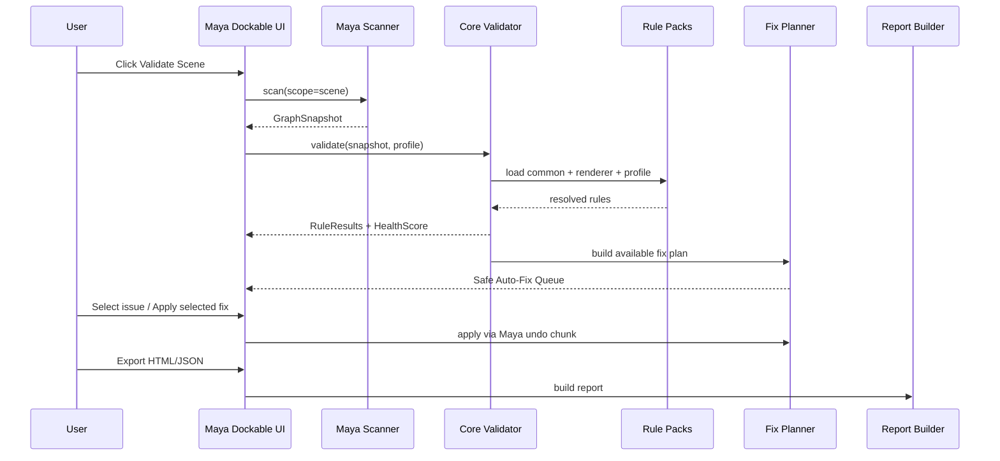
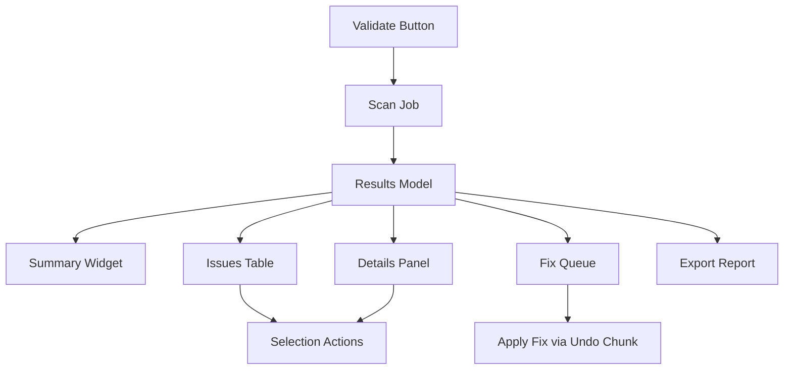
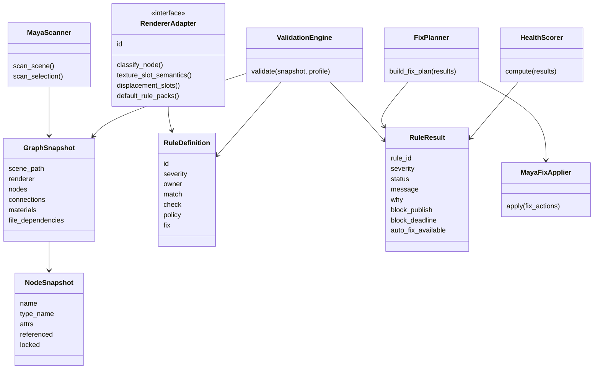

# Maya Pipeline Inspector — Production Development Plan

> **v0.1.0 shipped** (2026-07-03). **v0.2.0 shipped** (2026-07-06). **v0.3.0 shipped** (2026-07-07). **v0.4.0 shipped** (2026-07-08). **v0.5.0 shipped** (2026-07-12). **v1.0+** — see [§27](#27-roadmap). v0.5 detail: [V0_5_DEVELOPMENT_PLAN.md](V0_5_DEVELOPMENT_PLAN.md) (Milestones 29–41, Issues #113–#164).

**Project type:** Open-source Maya plug-in / pipeline QA framework  
**Primary user:** Technical Artist, Shader TD, Pipeline TD, Render Supervisor, Lookdev Artist  
**Primary DCC:** Autodesk Maya  
**Initial renderers:** Common Maya, V-Ray, Arnold  
**Future renderers:** RenderMan, Redshift, USD / MaterialX  
**Core principle:** Data-driven validation rules, renderer adapters, safe fixes, headless automation, production-safe UX.

---

## 1. Executive Summary

**Maya Pipeline Inspector** is a production-oriented material QA framework for Maya. It scans shading networks, texture dependencies, renderer-specific material settings, displacement setups, UDIM sets, texture versions, path policies, and shader graph complexity before publish or Deadline submission.

The tool answers a practical production question:

> Can this asset or shot be safely published or submitted to the render farm, and if not, what is broken, who owns the fix, how dangerous is it, and can it be fixed safely?

This project should not be a one-off V-Ray checker. It should be a reusable QA framework with:

- a Maya scanner layer;
- a renderer adapter layer;
- a data-driven JSON rule system;
- an issue/result model;
- a safe auto-fix queue;
- a dockable Maya UI;
- headless validation for mayapy / CI / publish hooks;
- Deadline submit integration;
- HTML / JSON reports;
- demo scenes and tests.

The first production-ready release should focus on **texture, shader, and farm-preflight safety**, not on solving every possible material problem. The roadmap should make future renderer and pipeline integrations easy without requiring a rewrite.

---

## 2. Production Problem

Feature animation and VFX productions often accumulate hundreds of unique materials across character, environment, prop, crowd, FX, and shot-level overrides. Common failures include:

- missing texture files;
- stale texture versions;
- wrong color space on data maps;
- broken UDIM tile sets;
- local artist paths that render farm machines cannot access;
- overly expensive displacement;
- shader graphs that became too complex over production;
- duplicate / orphan material networks;
- renderer plugin/version mismatch;
- referenced assets that cannot be safely modified in a shot scene;
- material issues discovered only after render farm resources have already been occupied.

The production cost is high because these issues are usually found late: during Deadline submission, overnight rendering, lighting review, compositing handoff, or final image QA. The tool should move material failure detection earlier: **before publish and before farm submission**.

---

## 3. Product Goals

### 3.1 Core Goals

1. Detect shader/material failures before render time.
2. Make material QA repeatable, data-driven, and explainable.
3. Support V-Ray and Arnold through renderer adapters while keeping the core renderer-agnostic.
4. Provide a fast, useful artist-facing dockable Maya panel.
5. Provide headless validation for publish systems, Deadline submission, and CI.
6. Provide safe auto-fixes with preview, undo, reference protection, and audit logging.
7. Produce useful reports for supervisors and pipeline review.
8. Be open-source and easy for studios to extend with their own rules.

### 3.2 Non-Goals for MVP

The first production release should **not** attempt to be:

- a full material converter between renderers;
- a full render regression system;
- a ShotGrid/FTrack replacement;
- a dependency manager for every file type in a Maya scene;
- a complete USD / MaterialX authoring tool;
- a realtime always-on scene monitor;
- a renderer performance simulator.

These can be future directions, but MVP must remain achievable.

---

## 4. Target Users and Value

### 4.1 Lookdev / Shading Artist

Needs:

- quickly know what is broken;
- jump to the bad node;
- understand why the rule matters;
- apply safe fixes without guessing;
- avoid rejected publishes or failed farm jobs.

Value:

- faster self-QA;
- fewer manual checks;
- fewer supervisor notes about technical mistakes.

### 4.2 Shader TD / Technical Artist

Needs:

- formalize material rules;
- create project/show-specific rule packs;
- detect shader library regressions;
- validate references and texture dependencies;
- keep material networks clean.

Value:

- QA standards become enforceable and repeatable;
- production incidents can become new rules;
- less time spent manually checking hundreds of nodes.

### 4.3 Render Supervisor

Needs:

- know if an asset/shot is safe for farm submission;
- identify high-risk materials;
- see what is blocking publish/render;
- get reports for review.

Value:

- reduced farm waste;
- faster incident triage;
- better visibility into asset health.

### 4.4 Pipeline TD

Needs:

- headless API;
- publish hook integration;
- Deadline submit integration;
- deterministic JSON reports;
- testable core independent of Maya UI.

Value:

- easy integration into existing pipeline;
- reliable automation;
- open-source foundation that can be extended per studio.

---

## 5. Product Principles

1. **Data-driven first.** Rules, profiles, renderers, severity, block policies, and fix permissions should be config-driven where practical.
2. **Renderer-agnostic core.** V-Ray and Arnold logic belongs in adapters/rule packs, not in the core validator.
3. **Explain every issue.** Every result must answer: what is wrong, why it matters, expected value, current value, suggested action.
4. **Safe by default.** No silent scene mutation. All fixes must be previewed, undoable, and reference-aware.
5. **Fast artist UX.** The UI should make common actions one click away: validate, filter, select node, frame graph, apply fix, export report.
6. **Headless parity.** Anything validated in UI should also work through mayapy/headless mode.
7. **Testable core.** The core validator must operate on plain Python snapshots, so most logic is testable without Maya.
8. **Production profiles.** Strictness must be configurable: sandbox, artist, publish, Deadline, supervisor.
9. **No false authority.** The tool should show confidence and rule source. Risky decisions require override/waiver.
10. **Open-source extensibility.** Studios should be able to add rules without modifying framework internals.

---

## 6. Feature Set and Scope Classification

| Feature | MVP | v1.x | Future | Notes |
|---|---:|---:|---:|---|
| Cross-renderer architecture | Yes | Yes | Yes | Start with Common Maya, V-Ray, Arnold |
| Material Health Score | Yes | Yes | Yes | Simple scoring in MVP, weighted later |
| Material Passport / Shader Manifest | Yes | Yes | Yes | JSON manifest first |
| Texture Freshness Check | Partial | Yes | Yes | MVP supports naming/version policy, later publish DB |
| UDIM Integrity Validator | Yes | Yes | Yes | Missing tiles, mixed resolution/bit depth if OIIO/Pillow available |
| Semantic Texture Slot Detection | Yes | Yes | Yes | Connection-based classification |
| Renderer Adapter Layer | Yes | Yes | Yes | Core API from day one |
| Shader Complexity Budget Profiler | Basic | Yes | Yes | Node count, graph depth, texture count first |
| Displacement Risk Analyzer | Yes | Yes | Yes | Missing/wrong colorspace/high amount |
| Optimized Texture / TX / Tiled Texture Check | Partial | Yes | Yes | Detect `.tx`/tiled freshness; generation optional later |
| Safe Auto-Fix Queue | Yes | Yes | Yes | colorSpace/path fixes first |
| Reference-Safe Mode | Yes | Yes | Yes | Scan references, do not modify by default |
| Waiver / Exception System | Partial | Yes | Yes | Sidecar JSON MVP |
| Issue Ownership | Yes | Yes | Yes | owner field in rules/results |
| “Why this matters” UI | Yes | Yes | Yes | Required in rule schema |
| Rule Authoring UI | No | Partial | Yes | MVP can ship JSON examples only |
| Incident-to-Rule Workflow | No | Partial | Yes | v1.x feature |
| Preflight Modes | Yes | Yes | Yes | artist/publish/deadline profiles |
| Incremental Scan Cache | No | Partial | Yes | Full scan MVP, cache later |
| Material Duplicate Detector | Basic | Yes | Yes | hash-based graph fingerprint later |
| Orphan / Dead Shader Network Cleanup | Yes | Yes | Yes | safe cleanup plan, not auto-delete by default |
| Path Policy Validator | Yes | Yes | Yes | core MVP |
| Farm Node Compatibility Check | Partial | Yes | Yes | path/env/plugin checks |
| Renderer Version Policy | Partial | Yes | Yes | detect loaded plugin versions |
| Visual Shader Graph Trace | Basic | Yes | Yes | connection path in UI/details |
| HTML Report | Yes | Yes | Yes | simple Jinja/template-free HTML first |
| Baseline / Diff Validation | Partial | Yes | Yes | manifest diff first |
| Separate Block Policy | Yes | Yes | Yes | rule severity separate from block flags |
| Rule Packs | Yes | Yes | Yes | common/vray/arnold/studio |
| Explainable Auto-Fix | Yes | Yes | Yes | required for each fix |
| Strict / Relaxed Profiles | Yes | Yes | Yes | JSON profile files |
| Texture Resolution Budget by Asset Type | Partial | Yes | Yes | config-driven thresholds |
| Lookdev Regression Snapshots | No | Partial | Yes | manifest + optional thumbnails later |
| Headless Batch Validator | Yes | Yes | Yes | mayapy entrypoint |
| Testable Core without Maya | Yes | Yes | Yes | architecture requirement |
| Dockable Maya Panel | Yes | Yes | Yes | workspaceControl/PySide UI |
| Deadline Submit Integration | Partial | Yes | Yes | preflight hook sample in MVP |
| Demo Scene | Yes | Yes | Yes | intentionally broken materials |

---

## 7. MVP Definition

### 7.1 MVP Name

**Maya Pipeline Inspector v0.1 — Texture & Shader Preflight MVP**

### 7.2 MVP Must Ship

1. Maya graph scanner for materials, shading engines, file nodes, displacement nodes, and core connections.
2. GraphSnapshot JSON model.
3. Core validation engine independent of Maya.
4. Rule schema and rule loader.
5. Common Maya rule pack.
6. Basic V-Ray adapter and rule pack.
7. Basic Arnold adapter and rule pack.
8. Texture path validation.
9. Missing texture validation.
10. UDIM tile presence validation.
11. Semantic texture slot detection for common color/data/displacement slots.
12. Wrong colorSpace validation for color vs data maps.
13. Displacement risk checks.
14. Basic shader complexity budget.
15. Reference-safe mode.
16. Material Health Score.
17. Issue result table in dockable Maya UI.
18. Select node / open attribute editor / copy path actions.
19. Safe auto-fix queue for low-risk fixes.
20. JSON report.
21. HTML report.
22. Headless mayapy command.
23. Deadline submit preflight example hook.
24. Demo scene with intentionally broken cases.
25. Pytest coverage for core validator using sample snapshots.

### 7.3 MVP Should Not Ship

- full rule authoring UI;
- full incident-to-rule workflow;
- background incremental scan cache;
- material graph visual node editor;
- texture generation pipeline;
- ShotGrid/FTrack integration;
- automatic deletion of material networks;
- thumbnail render regression.

---

## 8. Architecture Overview



### 8.1 Key Architectural Decision

The Maya-specific layer produces a pure Python / JSON `GraphSnapshot`. The core validation engine consumes only that snapshot and rule packs. This keeps rule evaluation testable without launching Maya.



---

## 9. Core Data Model

### 9.1 GraphSnapshot

Represents a scene or selection in renderer-agnostic form.

```python
@dataclass(frozen=True)
class GraphSnapshot:
    scene_path: str
    maya_version: str
    renderer: str | None
    scan_scope: Literal["scene", "selection", "asset"]
    scanned_at_utc: str
    nodes: list[NodeSnapshot]
    connections: list[ConnectionSnapshot]
    materials: list[MaterialSnapshot]
    shading_engines: list[ShadingEngineSnapshot]
    file_dependencies: list[FileDependencySnapshot]
    references: list[ReferenceSnapshot]
```

### 9.2 NodeSnapshot

```python
@dataclass(frozen=True)
class NodeSnapshot:
    id: str
    name: str
    full_name: str
    type_name: str
    renderer_family: str | None
    namespace: str | None
    referenced: bool
    reference_path: str | None
    locked: bool
    attrs: dict[str, JsonValue]
    classification: list[str]
```

### 9.3 ConnectionSnapshot

```python
@dataclass(frozen=True)
class ConnectionSnapshot:
    src_node: str
    src_attr: str
    dst_node: str
    dst_attr: str
    semantic: str | None
```

### 9.4 FileDependencySnapshot

```python
@dataclass(frozen=True)
class FileDependencySnapshot:
    node_id: str
    attr: str
    raw_path: str
    resolved_path: str | None
    exists: bool
    is_sequence: bool
    is_udim: bool
    udim_tiles: list[int]
    missing_udim_tiles: list[int]
    extension: str | None
    version: str | None
    latest_version: str | None
    mtime_utc: str | None
    size_bytes: int | None
    image_info: ImageInfo | None
```

### 9.5 MaterialSnapshot

```python
@dataclass(frozen=True)
class MaterialSnapshot:
    node_id: str
    name: str
    type_name: str
    renderer_family: str | None
    shading_engines: list[str]
    assigned_shapes: list[str]
    texture_nodes: list[str]
    displacement_nodes: list[str]
    graph_node_count: int
    graph_depth: int
    graph_fingerprint: str
```

### 9.6 RuleResult

```python
@dataclass(frozen=True)
class RuleResult:
    rule_id: str
    severity: Literal["info", "warning", "error", "critical"]
    status: Literal["passed", "failed", "waived", "skipped"]
    title: str
    message: str
    why: str
    owner: str
    material: str | None
    node: str | None
    plug: str | None
    current_value: JsonValue | None
    expected_value: JsonValue | None
    block_publish: bool
    block_deadline: bool
    auto_fix_available: bool
    fix_id: str | None
    graph_trace: list[str]
    evidence: dict[str, JsonValue]
```

### 9.7 FixAction

```python
@dataclass(frozen=True)
class FixAction:
    fix_id: str
    rule_id: str
    title: str
    risk: Literal["low", "medium", "high"]
    target_node: str
    target_attr: str | None
    before_value: JsonValue | None
    after_value: JsonValue | None
    explanation: str
    requires_supervisor: bool
    modifies_reference: bool
    undo_supported: bool
```

---

## 10. Rule Schema

Rules must be data-driven. The engine should support multiple rule types instead of hardcoding everything in Python.

### 10.1 Rule Fields

```json
{
  "id": "common.texture.colorspace.data_raw",
  "name": "Data textures must use Raw color space",
  "enabled": true,
  "renderer": ["common", "vray", "arnold"],
  "scope": "texture_node",
  "severity": "critical",
  "owner": "shader_td",
  "message": "Data texture uses a color-managed color space.",
  "why": "Scalar maps such as roughness, masks, normal, bump, and displacement must not be transformed as color data because color transforms alter numeric values.",
  "match": {
    "semantic_slot": ["roughness", "metalness", "normal", "bump", "displacement", "mask"],
    "node_type": ["file", "VRayBitmap", "aiImage"]
  },
  "check": {
    "type": "attribute_equals",
    "attribute": "colorSpace",
    "expected": "Raw"
  },
  "policy": {
    "block_publish": true,
    "block_deadline": true,
    "waiver_allowed": true,
    "auto_fix_allowed": true
  },
  "fix": {
    "type": "set_attr",
    "attribute": "colorSpace",
    "value": "Raw",
    "risk": "low"
  }
}
```

### 10.2 Required Rule Concepts

Every rule must define:

- `id` — stable unique ID;
- `severity` — how bad the issue is;
- `policy` — whether it blocks publish or Deadline;
- `owner` — who should fix it;
- `message` — short UI message;
- `why` — educational explanation;
- `match` — target nodes/materials/files;
- `check` — validation operation;
- optional `fix` — safe auto-fix definition.

### 10.3 Rule Types for MVP

| Rule Type | Purpose |
|---|---|
| `attribute_equals` | Check attr value equals expected |
| `attribute_in` | Check attr is in allowed list |
| `path_exists` | Check texture path exists |
| `path_policy` | Check local/network/project path rules |
| `udim_complete` | Check UDIM set has expected tiles |
| `texture_version_latest` | Check version pattern against latest available version |
| `color_space_by_semantic` | Check color/data colorSpace using semantic slot |
| `graph_budget` | Check graph node count/depth/texture count |
| `displacement_risk` | Check displacement-specific rules |
| `optimized_texture_freshness` | Check `.tx`/tiled texture exists and is newer than source |
| `orphan_network` | Check unassigned/dead material networks |
| `duplicate_fingerprint` | Detect duplicate material graphs |

---

## 11. Rule Packs

### 11.1 Rule Pack Layout

```text
rules/
├── common/
│   ├── texture_paths.json
│   ├── color_space.json
│   ├── udim_integrity.json
│   ├── shader_graph_hygiene.json
│   ├── displacement_common.json
│   └── farm_preflight.json
├── vray/
│   ├── vray_materials.json
│   ├── vray_displacement.json
│   └── vray_optimization.json
├── arnold/
│   ├── arnold_standard_surface.json
│   ├── arnold_image.json
│   └── arnold_tx.json
├── profiles/
│   ├── artist_relaxed.json
│   ├── publish_strict.json
│   ├── deadline_critical.json
│   └── supervisor_full.json
└── studio_overrides/
    └── example_show_policy.json
```

### 11.2 Load Order

```text
common rules
-> renderer rules
-> studio rules
-> show rules
-> profile overrides
-> user overrides
```

Later files may override severity, policy, thresholds, or enabled state, but not silently change rule IDs.

---

## 12. Renderer Adapter Layer

### 12.1 Adapter Interface

```python
class RendererAdapter(Protocol):
    id: str
    display_name: str

    def is_available(self) -> bool: ...
    def detect_scene_renderer(self, snapshot: GraphSnapshot) -> bool: ...
    def supported_node_types(self) -> set[str]: ...
    def classify_node(self, node: NodeSnapshot) -> list[str]: ...
    def texture_slot_semantics(self) -> dict[str, str]: ...
    def displacement_slots(self) -> list[str]: ...
    def complexity_weights(self) -> dict[str, float]: ...
    def default_rule_packs(self) -> list[str]: ...
```

### 12.2 Common Maya Adapter

Responsibilities:

- `file` texture nodes;
- Maya `shadingEngine`;
- `displacementShader` connections;
- common `bump2d`, `place2dTexture`, `lambert`, `standardSurface` basics;
- default material checks;
- common path/colorSpace/UDIM rules.

### 12.3 V-Ray Adapter

Initial supported node families:

- `VRayMtl`;
- `VRayBlendMtl`;
- `VRayFastSSS2` if available;
- `VRayBitmap` if used;
- V-Ray displacement-related nodes/settings;
- V-Ray normal/bump nodes if available.

Initial V-Ray checks:

- diffuse/base color semantic;
- reflection glossiness/roughness data slot;
- metalness data slot;
- normal/bump data slot;
- displacement map and amount checks;
- expensive blend material graph budget;
- local texture path / missing texture / UDIM checks.

### 12.4 Arnold Adapter

Initial supported node families:

- `aiStandardSurface`;
- `aiImage`;
- `aiNormalMap`;
- `aiBump2d`;
- Maya/Arnold displacement connections;
- `aiLayerShader` / `aiMixShader` basic complexity scoring.

Initial Arnold checks:

- base color vs data texture semantic;
- `.tx` freshness check if studio profile enables it;
- normal/bump/displacement colorSpace policy;
- graph budget;
- local/missing/UDIM checks.

---

## 13. Validation Pipeline



---

## 14. Validation Domains

### 14.1 Texture Path Policy Validator

Checks:

- file exists;
- no local drive paths for farm-blocking profiles;
- no user desktop/download/temp paths;
- no paths outside project root;
- no old server roots;
- path uses approved variables such as `$SHOW`, `$ASSET_ROOT`, `$TEXTURE_ROOT` when profile requires it;
- no mixed slash/backslash policy violations;
- network path can be normalized for farm compatibility.

Severity examples:

| Issue | Default Severity | Block Deadline |
|---|---:|---:|
| Missing texture | Critical | Yes |
| Local artist path | Critical | Yes |
| Texture outside project root | Error | Profile-dependent |
| Mixed path slashes | Warning | No |

### 14.2 Texture Freshness Check

MVP can implement version discovery using naming convention:

```text
asset_diffuse_v001.<UDIM>.exr
asset_diffuse_v002.<UDIM>.exr
asset_diffuse_v003.<UDIM>.exr
```

Checks:

- current version vs latest version in the same publish folder;
- version pattern missing;
- texture source newer than optimized texture;
- map set uses mixed versions.

Future:

- integrate with asset publish database;
- approved/latest distinction;
- per-shot locked texture versions.

### 14.3 UDIM Integrity Validator

Checks:

- missing tiles;
- duplicate tiles;
- mixed extension;
- mixed resolution;
- mixed channel count;
- mixed bit depth;
- zero-byte files;
- suspiciously small files;
- texture sets have inconsistent tile coverage between albedo/roughness/normal/displacement.

MVP:

- detect UDIM pattern;
- list existing tiles;
- compare required tile set if reference slot exists;
- report missing tiles;
- optional image metadata if dependency available.

### 14.4 Semantic Texture Slot Detection

Do not validate colorSpace based only on node type. Validate based on connection destination.

Examples:

```text
file.outColor -> VRayMtl.diffuseColor        => color data
file.outColor -> aiStandardSurface.baseColor => color data
file.outAlpha -> VRayMtl.reflectionGlossiness => scalar data
file.outColor -> aiNormalMap.input           => vector/data
file.outAlpha -> displacementShader.displacement => scalar data
```

This requires connection tracing from texture nodes to material inputs. Semantic classification should be provided by renderer adapters.

### 14.5 Shader Complexity Budget Profiler

Initial metrics:

- graph node count;
- texture node count;
- graph depth;
- number of layer/blend nodes;
- number of procedural nodes;
- displacement enabled;
- transparency/opacity usage;
- total referenced texture resolution estimate.

Example profile thresholds:

```json
{
  "asset_classes": {
    "hero_character": {
      "max_graph_nodes": 80,
      "max_textures": 32,
      "max_graph_depth": 12
    },
    "background_prop": {
      "max_graph_nodes": 25,
      "max_textures": 8,
      "max_graph_depth": 6
    }
  }
}
```

### 14.6 Displacement Risk Analyzer

Checks:

- displacement connected but file missing;
- displacement texture colorSpace is not Raw/data;
- displacement amount is above threshold;
- displacement enabled on background/low-priority asset;
- displacement map lacks expected UDIM tiles;
- vector/scalar displacement mismatch;
- displacement source/optimized texture stale;
- displacement connected to unassigned material network.

### 14.7 Optimized Texture / TX / Tiled Texture Check

Checks:

- optimized file exists;
- optimized file is newer than source;
- optimized file lives in approved cache/publish folder;
- source file is too large and optimized version is missing;
- profile-specific requirement for `.tx`, tiled EXR, or TIFF.

MVP should **detect and report**, not necessarily generate optimized textures. Generation can be a future optional fix.

### 14.8 Duplicate and Orphan Network Checks

Checks:

- material not assigned to any geometry;
- shadingEngine has no members;
- texture nodes not connected to renderable materials;
- default `lambert1` assigned to production geometry;
- duplicate material graph fingerprints;
- duplicate texture networks.

Safe cleanup should be opt-in and preview-only in MVP.

### 14.9 Farm Node Compatibility Check

Checks:

- no local file paths;
- renderer plugin appears available in current Maya session;
- required env vars exist;
- project root variables resolve;
- OCIO path exists if profile requires OCIO;
- Deadline preflight profile returns no blocking issues.

### 14.10 Renderer Version Policy

Checks:

- active renderer family;
- detected plugin version when possible;
- expected version from profile;
- unsupported/deprecated material node types.

---

## 15. Health Score System

### 15.1 Score Model

Start simple:

```text
score = 100
score -= critical_count * 25
score -= error_count * 10
score -= warning_count * 3
score -= info_count * 0
score = clamp(score, 0, 100)
```

Add caps:

- any blocking critical issue: max score 49;
- any farm-blocking issue: `farm_block = true`;
- any publish-blocking issue: `publish_block = true`.

### 15.2 Display

```text
Scene Health: 76 / 100
Critical: 1   Error: 2   Warning: 14   Info: 8
Publish Block: YES
Deadline Block: YES
Auto-fixable: 9
Waived: 2
```

### 15.3 Future Scoring

- rule weights;
- asset class weights;
- graph complexity score;
- texture budget score;
- historical regression penalty;
- profile-specific scoring.

---

## 16. Safe Auto-Fix Design

### 16.1 Rules

Auto-fix is allowed only when:

- rule policy allows auto-fix;
- node is not referenced, unless reference edits are explicitly allowed;
- node is not locked;
- target attr exists and is writable;
- fix has a defined before/after state;
- fix can be wrapped in Maya undo chunk;
- fix risk is accepted by current profile/user.

### 16.2 Fix Types for MVP

| Fix Type | Example | Risk |
|---|---|---:|
| `set_attr` | `file.colorSpace = Raw` | Low |
| `relink_path` | relink outdated texture to latest version | Medium |
| `normalize_path` | convert path to env-var project path | Medium |
| `disable_feature` | disable displacement on background asset | High |
| `cleanup_orphan` | delete unused shader network | High, preview-only |

### 16.3 Fix Queue UX

```text
Safe Auto-Fix Queue
[ ] file_dress_roughness.colorSpace: ACEScg -> Raw
[ ] file_normal.colorSpace: sRGB -> Raw
[ ] file_albedo.path: v008 -> v014

Buttons:
[Preview Selected] [Apply Safe Fixes] [Apply Selected] [Export Fix Plan]
```

### 16.4 Explainable Auto-Fix

Every fix must show:

- before value;
- after value;
- reason;
- risk;
- affected node;
- whether reference edit is required;
- whether undo is supported.

---

## 17. Waiver / Exception System

### 17.1 MVP Storage

Use sidecar JSON:

```text
scene_name.pipeline_inspector_waivers.json
```

### 17.2 Waiver Schema

```json
{
  "waivers": [
    {
      "id": "waiver_001",
      "rule_id": "common.texture.resolution.max",
      "target_node": "hero_face_disp_file",
      "target_material": "hero_face_skin_MTL",
      "reason": "Hero close-up approved by supervisor.",
      "approved_by": "Pavel Kuzmenko",
      "created_at": "2026-06-30T10:00:00Z",
      "expires_at": "2026-07-30T10:00:00Z"
    }
  ]
}
```

### 17.3 Policy

- Critical farm-blocking errors should be waiver-disabled by default unless profile allows it.
- Waivers must expire.
- UI must show waived issues separately.
- Reports must include waived issues.

---

## 18. Preflight Modes / Profiles

### 18.1 Profile Types

| Profile | Use Case | Behavior |
|---|---|---|
| `artist_relaxed` | interactive lookdev | warns more, blocks less |
| `publish_strict` | asset publish | blocks critical/error issues |
| `deadline_critical` | farm submit | fast critical-only scan |
| `supervisor_full` | review/audit | all rules enabled |
| `ci_headless` | automated validation | deterministic, no UI |

### 18.2 Profile Example

```json
{
  "id": "deadline_critical",
  "display_name": "Deadline Critical Preflight",
  "rule_overrides": {
    "common.texture.missing": {
      "enabled": true,
      "severity": "critical",
      "block_deadline": true
    },
    "common.shader.orphan_network": {
      "enabled": false
    }
  },
  "scan": {
    "include_references": true,
    "read_image_metadata": false,
    "critical_only": true
  }
}
```

---

## 19. UI / UX Design

### 19.1 Dockable Panel Layout

```text
+--------------------------------------------------------------------------------+
| Maya Pipeline Inspector                                                    |
| Scene: char_cinderella_shading_v042.ma    Renderer: V-Ray    Profile: Publish  |
| Health: 78/100   Critical:2 Error:5 Warning:17 Info:31   Farm Block: YES       |
| [Validate Scene] [Validate Selection] [Apply Safe Fixes] [Export Report]        |
+--------------------------------------------------------------------------------+
| Filters: [All severities] [Blocking only] [Auto-fixable] [Owner] [Renderer]     |
+--------------------------------------------------------------------------------+
| Sev | Material | Node | Issue | Auto-Fix | Owner | Rule ID                     |
|-----|----------|------|-------|----------|-------|-----------------------------|
| CRI | dress    | file | Roughness colorSpace is ACEScg | Yes | Shader TD | ... |
| ERR | shoe     | file | Missing UDIM tile 1007         | No  | Texture   | ... |
+--------------------------------------------------------------------------------+
| Issue Details                                                                   |
| What: Roughness texture is color-managed as ACEScg.                             |
| Why: Roughness is scalar data; color transforms alter numeric values.           |
| Current: ACEScg                                                                 |
| Expected: Raw                                                                   |
| Trace: file_roughness.outAlpha -> VRayMtl.reflectionGlossiness                 |
| [Select Node] [Frame in Hypershade] [Open Attr Editor] [Apply Fix] [Waive]      |
+--------------------------------------------------------------------------------+
```

### 19.2 UI Requirements

- Maya dockable panel.
- Non-destructive validation.
- Fast filtering.
- Severity colors.
- Health summary.
- Select material/node.
- Open Attribute Editor.
- Copy file path / reveal in Explorer.
- Graph trace display.
- Fix queue.
- Waiver creation.
- Export JSON/HTML.

### 19.3 UI Model



---

## 20. Headless CLI

### 20.1 Commands

```bash
mayapy -m pipeline_inspector validate scene.ma --profile publish_strict --report report.json
mayapy -m pipeline_inspector validate scene.ma --profile deadline_critical --critical-only
mayapy -m pipeline_inspector validate scene.ma --renderer vray --html report.html
mayapy -m pipeline_inspector manifest scene.ma --out shader_manifest.json
mayapy -m pipeline_inspector diff old_manifest.json new_manifest.json --html diff.html
```

### 20.2 Exit Codes

| Exit Code | Meaning |
|---:|---|
| 0 | No blocking issues |
| 1 | Publish-blocking issues |
| 2 | Deadline-blocking issues |
| 3 | Tool/runtime error |
| 4 | Invalid config/profile/rules |

### 20.3 Headless Output Contract

The tool must write a deterministic JSON report:

```json
{
  "status": "failed",
  "health_score": 42,
  "block_publish": true,
  "block_deadline": true,
  "summary": {
    "critical": 2,
    "error": 4,
    "warning": 12,
    "info": 8
  },
  "results": []
}
```

---

## 21. Deadline Submit Integration

### 21.1 Integration Goal

Before submitting a Maya render job to Deadline, run the validator in `deadline_critical` mode and block submission if farm-blocking issues exist.

### 21.2 Integration Modes

1. **Maya UI submit hook** — validate current scene before artist submits.
2. **Deadline submitter wrapper** — run headless validation as part of submit tool.
3. **Repository event plugin** — future optional server-side validation.

### 21.3 MVP Behavior

- run critical-only scan;
- generate JSON report next to scene or temp location;
- block submission if `block_deadline=true`;
- show artist-friendly summary;
- allow supervisor override only if profile permits.

---

## 22. Material Passport / Shader Manifest

### 22.1 Purpose

Material Passport makes asset state auditable and diffable. It answers:

- what materials exist;
- what textures they use;
- which texture versions are linked;
- what renderer nodes are used;
- what issues exist;
- what changed since last publish.

### 22.2 Manifest Contents

```json
{
  "schema_version": "1.0",
  "asset": "char_cinderella",
  "scene": "char_cinderella_shading_v042.ma",
  "renderer": "vray",
  "health_score": 91,
  "materials": [
    {
      "name": "dress_silk_MTL",
      "type": "VRayMtl",
      "graph_fingerprint": "sha256:...",
      "textures": [
        {
          "semantic": "base_color",
          "path": "$ASSET_ROOT/tex/dress_albedo_v014.<UDIM>.exr",
          "exists": true,
          "version": "014",
          "udim_tiles": [1001, 1002, 1003]
        }
      ],
      "issues": []
    }
  ]
}
```

### 22.3 Diff Validation

Compare previous approved manifest with current manifest:

```text
New issues:
+ file_roughness colorSpace changed Raw -> ACEScg
+ albedo texture relinked v014 -> local desktop file

Resolved:
- missing normal tile 1007 fixed

Changed:
- displacement amount 0.8 -> 2.5
```

---

## 23. Project Repository Structure

```text
maya-pipeline-inspector/
├── README.md
├── LICENSE
├── pyproject.toml
├── requirements.txt
├── requirements-dev.txt
├── .gitignore
├── .github/
│   ├── workflows/
│   │   ├── ci.yml
│   │   └── docs.yml
│   └── ISSUE_TEMPLATE/
│       ├── bug_report.md
│       ├── feature_request.md
│       └── rule_request.md
├── docs/
│   ├── DEVELOPMENT_PLAN.md
│   ├── ARCHITECTURE.md
│   ├── RULE_AUTHORING.md
│   ├── USER_GUIDE.md
│   ├── DEADLINE_INTEGRATION.md
│   ├── RELEASE_CHECKLIST.md
│   └── images/
├── maya_module/
│   ├── pipeline_inspector.mod
│   ├── scripts/
│   │   └── pipeline_inspector_bootstrap.py
│   ├── shelves/
│   │   └── shelf_PipelineInspector.mel
│   └── icons/
├── src/
│   └── pipeline_inspector/
│       ├── __init__.py
│       ├── __main__.py
│       ├── version.py
│       ├── core/
│       │   ├── models.py
│       │   ├── rule_schema.py
│       │   ├── rule_loader.py
│       │   ├── validator.py
│       │   ├── scoring.py
│       │   ├── waivers.py
│       │   ├── fix_plan.py
│       │   ├── reports.py
│       │   ├── manifest.py
│       │   └── diff.py
│       ├── maya/
│       │   ├── scanner.py
│       │   ├── graph_trace.py
│       │   ├── selection.py
│       │   ├── fix_applier.py
│       │   ├── reference_safety.py
│       │   ├── ui_launcher.py
│       │   └── commands.py
│       ├── ui/
│       │   ├── main_window.py
│       │   ├── models.py
│       │   ├── delegates.py
│       │   ├── widgets.py
│       │   ├── resources.py
│       │   └── styles.qss
│       ├── adapters/
│       │   ├── base.py
│       │   ├── common_maya.py
│       │   ├── vray.py
│       │   └── arnold.py
│       ├── rules/
│       │   ├── common/
│       │   ├── vray/
│       │   ├── arnold/
│       │   └── profiles/
│       ├── deadline/
│       │   ├── submit_preflight.py
│       │   └── README.md
│       └── utils/
│           ├── paths.py
│           ├── udim.py
│           ├── image_info.py
│           ├── hashing.py
│           ├── logging.py
│           └── json_io.py
├── examples/
│   ├── broken_scene/
│   │   ├── pipeline_inspector_demo_broken.ma
│   │   ├── textures/
│   │   └── expected_report.json
│   ├── rules/
│   └── reports/
├── tests/
│   ├── unit/
│   │   ├── test_rule_loader.py
│   │   ├── test_validator_core.py
│   │   ├── test_scoring.py
│   │   ├── test_udim.py
│   │   ├── test_path_policy.py
│   │   ├── test_manifest.py
│   │   └── test_diff.py
│   ├── fixtures/
│   │   ├── snapshots/
│   │   ├── rules/
│   │   └── reports/
│   └── integration/
│       ├── test_maya_scanner_contract.py
│       └── README.md
└── tools/
    ├── validate_rules.py
    ├── build_demo_report.py
    ├── check_non_ascii.py
    └── generate_issue_list.py
```

---

## 24. Mermaid Component Diagram



---

## 25. Implementation Order

### Phase 0 — Repository Bootstrap

Goal: create clean open-source foundation.

Tasks:

1. Create repository and Python package skeleton.
2. Add `pyproject.toml`.
3. Add MIT license.
4. Add CI for pure Python tests.
5. Add formatting/linting config.
6. Add README with project scope.
7. Add contribution guide and rule authoring guide stub.
8. Add test fixtures folder.

Deliverable:

- importable package;
- passing empty CI;
- documented development setup.

### Phase 1 — Core Models and Rule Engine

Goal: validate snapshot fixtures without Maya.

Tasks:

1. Implement `GraphSnapshot`, `NodeSnapshot`, `ConnectionSnapshot`, `MaterialSnapshot`.
2. Implement `RuleDefinition` and schema validation.
3. Implement JSON rule loading and profile overrides.
4. Implement base rule evaluation.
5. Implement `RuleResult` model.
6. Implement severity/block policy separation.
7. Implement health score.
8. Add unit tests.

Deliverable:

- `pytest` can validate sample JSON snapshots.

### Phase 2 — Maya Scanner Contract

Goal: generate real `GraphSnapshot` from Maya.

Tasks:

1. Implement scene/selection scanning.
2. Traverse shading engines and material networks.
3. Collect node types, attrs, connections, references, locks.
4. Collect file dependencies.
5. Normalize paths.
6. Detect renderer family.
7. Export snapshot JSON.
8. Add scanner contract tests using saved fixtures / mocked data.

Deliverable:

- `pipeline_inspector.scan_current_scene()` returns deterministic snapshot.

### Phase 3 — Renderer Adapters

Goal: support Common Maya, V-Ray, Arnold initial semantic classification.

Tasks:

1. Implement adapter interface.
2. Implement Common Maya adapter.
3. Implement V-Ray adapter with initial node/plug mapping.
4. Implement Arnold adapter with initial node/plug mapping.
5. Implement semantic texture slot detection.
6. Add adapter tests with snapshot fixtures.

Deliverable:

- color/data/displacement slot semantics work across basic V-Ray/Arnold graphs.

### Phase 4 — MVP Rule Packs

Goal: cover the most valuable production failures.

Tasks:

1. Texture missing/path rules.
2. Local path rules.
3. ColorSpace rules by semantic slot.
4. UDIM missing tile rules.
5. Texture freshness by version naming.
6. Displacement risk rules.
7. Shader complexity budget rules.
8. Orphan material rules.
9. Farm preflight rules.
10. Tests for every rule.

Deliverable:

- broken demo snapshots produce expected results.

### Phase 5 — Reports and Manifest

Goal: produce useful review artifacts.

Tasks:

1. JSON report writer.
2. HTML report writer.
3. Material Passport / Shader Manifest writer.
4. Manifest diff command.
5. Report tests.
6. Example report in README.

Deliverable:

- `report.json`, `report.html`, `manifest.json`.

### Phase 6 — Maya UI

Goal: usable dockable panel.

Tasks:

1. UI launcher.
2. Dockable panel.
3. Summary widget.
4. Issues table.
5. Details panel.
6. Selection actions.
7. Fix queue view.
8. Waiver view.
9. Export report actions.
10. Basic QSS styling.

Deliverable:

- artist can validate scene and navigate issues in Maya.

### Phase 7 — Safe Auto-Fix

Goal: controlled fixes.

Tasks:

1. Fix planner.
2. Fix action model.
3. Maya undo chunk applier.
4. Reference safety checks.
5. Apply selected fix.
6. Apply safe fixes.
7. Fix report/audit log.
8. Tests for fix planning.

Deliverable:

- low-risk fixes such as colorSpace changes are safe and undoable.

### Phase 8 — Headless and Deadline Integration

Goal: production automation.

Tasks:

1. `mayapy -m pipeline_inspector validate` command.
2. Exit code contract.
3. Deadline preflight example.
4. Publish hook example.
5. Documentation.
6. CI tests for headless core command using snapshots.

Deliverable:

- can block Deadline submission based on critical issues.

### Phase 9 — Demo, Docs, Release

Goal: public portfolio release.

Tasks:

1. Broken demo scene.
2. Demo textures.
3. Screenshots/GIFs.
4. README polish.
5. User guide.
6. Rule authoring guide.
7. Release notes.
8. Public v0.1 release.

---

## 26. GitHub Milestones and Issues

### Milestone 0 — Project Bootstrap

#### Issue 1 — Initialize repository structure

Labels: `setup`, `infrastructure`  
Acceptance criteria:

- `src/pipeline_inspector` package exists;
- package imports successfully;
- README has project description;
- MIT license added.

#### Issue 2 — Add Python packaging configuration

Labels: `setup`, `python`  
Acceptance criteria:

- `pyproject.toml` defines package metadata;
- editable install works;
- dev dependencies documented.

#### Issue 3 — Add CI for pure Python tests

Labels: `ci`, `testing`  
Acceptance criteria:

- GitHub Actions runs pytest;
- CI runs on PR and push;
- Python matrix defined.

#### Issue 4 — Add initial documentation skeleton

Labels: `docs`  
Acceptance criteria:

- `docs/ARCHITECTURE.md` exists;
- `docs/RULE_AUTHORING.md` exists;
- `docs/USER_GUIDE.md` exists.

---

### Milestone 1 — Core Validation Engine

#### Issue 5 — Implement core snapshot models

Labels: `core`, `models`  
Acceptance criteria:

- `GraphSnapshot`, `NodeSnapshot`, `ConnectionSnapshot`, `MaterialSnapshot`, `FileDependencySnapshot` implemented;
- JSON serialization/deserialization works;
- tests cover round-trip.

#### Issue 6 — Implement rule definition model

Labels: `core`, `rules`  
Acceptance criteria:

- rule schema model exists;
- required fields validated;
- invalid rules produce useful errors.

#### Issue 7 — Implement rule loader and profile override resolver

Labels: `core`, `rules`, `profiles`  
Acceptance criteria:

- common + renderer + profile rules load in deterministic order;
- profile overrides can disable rules/change severity/block policy;
- tests cover override precedence.

#### Issue 8 — Implement base validation engine

Labels: `core`, `rules`  
Acceptance criteria:

- engine evaluates rules against snapshots;
- returns `RuleResult` list;
- supports pass/fail/skipped states.

#### Issue 9 — Implement severity and block policy separation

Labels: `core`, `policy`  
Acceptance criteria:

- severity does not automatically imply block flags;
- `block_publish` and `block_deadline` are explicit;
- summary computes block status correctly.

#### Issue 10 — Implement Material Health Score

Labels: `core`, `scoring`  
Acceptance criteria:

- score computed from results;
- blocking critical issues cap score;
- tests cover critical/error/warning combinations.

---

### Milestone 2 — Maya Scanner

#### Issue 11 — Implement Maya scene scanner entrypoint

Labels: `maya`, `scanner`  
Acceptance criteria:

- `scan_scene()` returns `GraphSnapshot`;
- `scan_selection()` returns selection-limited snapshot;
- scanner can run from Maya Script Editor.

#### Issue 12 — Traverse shading engines and material networks

Labels: `maya`, `scanner`, `shader-graph`  
Acceptance criteria:

- shading engines collected;
- connected materials collected;
- upstream material graph nodes collected;
- graph connections recorded.

#### Issue 13 — Collect node attributes safely

Labels: `maya`, `scanner`  
Acceptance criteria:

- selected attrs captured by type;
- unreadable attrs skipped with debug log;
- referenced/locked flags captured.

#### Issue 14 — Collect file texture dependencies

Labels: `maya`, `textures`  
Acceptance criteria:

- file nodes collected;
- raw and normalized paths stored;
- existence status captured;
- UDIM patterns detected.

#### Issue 15 — Implement reference-safe metadata collection

Labels: `maya`, `references`, `safety`  
Acceptance criteria:

- nodes from references are marked;
- reference path captured;
- scanner does not modify scene.

---

### Milestone 3 — Renderer Adapters

#### Issue 16 — Define renderer adapter protocol

Labels: `architecture`, `renderer`  
Acceptance criteria:

- base adapter interface exists;
- adapter registry exists;
- tests can register fake adapter.

#### Issue 17 — Implement Common Maya adapter

Labels: `renderer`, `common-maya`  
Acceptance criteria:

- common node types classified;
- file/color/data/displacement semantic mapping exists.

#### Issue 18 — Implement V-Ray adapter MVP

Labels: `renderer`, `vray`  
Acceptance criteria:

- V-Ray material node types classified;
- basic V-Ray texture slot semantics implemented;
- tests cover V-Ray snapshot fixture.

#### Issue 19 — Implement Arnold adapter MVP

Labels: `renderer`, `arnold`  
Acceptance criteria:

- Arnold node types classified;
- aiStandardSurface/aiImage basics supported;
- tests cover Arnold snapshot fixture.

#### Issue 20 — Implement semantic texture slot resolver

Labels: `core`, `renderer`, `textures`  
Acceptance criteria:

- connection destination determines semantic slot;
- color vs data slots classified;
- ambiguous slots produce warning/unknown classification.

---

### Milestone 4 — Production Rules MVP

#### Issue 21 — Implement missing texture rule

Labels: `rules`, `textures`, `critical`  
Acceptance criteria:

- missing texture reports critical by default;
- Deadline block flag set by profile;
- tests cover missing file path.

#### Issue 22 — Implement path policy rules

Labels: `rules`, `paths`, `farm`  
Acceptance criteria:

- local drive paths detected;
- user desktop/temp paths detected;
- project-root policy supported.

#### Issue 23 — Implement UDIM integrity rules

Labels: `rules`, `udim`, `textures`  
Acceptance criteria:

- UDIM tokens detected;
- missing tiles reported;
- mixed map set coverage can be detected from snapshot.

#### Issue 24 — Implement colorSpace by semantic slot rules

Labels: `rules`, `colorspace`, `renderer`  
Acceptance criteria:

- color maps expect color profile;
- data maps expect Raw/profile-defined value;
- auto-fix generated for low-risk attr changes.

#### Issue 25 — Implement texture freshness rule

Labels: `rules`, `textures`, `versioning`  
Acceptance criteria:

- version token parsed;
- latest version in folder detected;
- outdated texture reported.

#### Issue 26 — Implement displacement risk rules

Labels: `rules`, `displacement`, `render-risk`  
Acceptance criteria:

- missing displacement texture detected;
- wrong colorSpace detected;
- high displacement amount threshold supported.

#### Issue 27 — Implement shader complexity budget profiler

Labels: `rules`, `performance`, `profiler`  
Acceptance criteria:

- graph node count stored;
- texture count stored;
- graph depth stored;
- budget rules compare against profile thresholds.

#### Issue 28 — Implement optimized texture freshness check

Labels: `rules`, `textures`, `optimization`  
Acceptance criteria:

- `.tx`/optimized path policy supported;
- source newer than optimized reported;
- missing optimized texture can warn/error by profile.

#### Issue 29 — Implement orphan/dead shader network checks

Labels: `rules`, `cleanup`  
Acceptance criteria:

- unassigned materials reported;
- empty shading engines reported;
- default material on production geometry detected if fixture provides assignment.

---

### Milestone 5 — Reports and Manifest

#### Issue 30 — Implement JSON report writer

Labels: `reports`, `core`  
Acceptance criteria:

- writes deterministic JSON;
- includes summary, score, block status, results;
- snapshot/report schema version included.

#### Issue 31 — Implement HTML report writer

Labels: `reports`, `html`  
Acceptance criteria:

- generates self-contained HTML;
- severity groups visible;
- blocking status visible.

#### Issue 32 — Implement Material Passport / Shader Manifest

Labels: `manifest`, `reports`  
Acceptance criteria:

- material manifest generated;
- textures and versions included;
- graph fingerprint included.

#### Issue 33 — Implement manifest diff command

Labels: `manifest`, `diff`  
Acceptance criteria:

- old/new manifests compared;
- new/resolved/changed issues listed;
- JSON diff output produced.

---

### Milestone 6 — Maya UI MVP

#### Issue 34 — Create dockable Maya panel

Labels: `ui`, `maya`  
Acceptance criteria:

- panel opens from shelf/menu/script;
- panel docks in Maya workspace;
- panel can be closed/reopened.

#### Issue 35 — Implement summary/header widget

Labels: `ui`  
Acceptance criteria:

- health score shown;
- severity counts shown;
- block status shown;
- profile dropdown shown.

#### Issue 36 — Implement issues table

Labels: `ui`, `results`  
Acceptance criteria:

- displays severity/material/node/issue/owner/rule;
- supports filtering;
- supports sorting.

#### Issue 37 — Implement issue details panel

Labels: `ui`, `explainability`  
Acceptance criteria:

- message and why displayed;
- current/expected values displayed;
- graph trace displayed;
- fix availability displayed.

#### Issue 38 — Implement Maya selection/navigation actions

Labels: `ui`, `maya`  
Acceptance criteria:

- select node action works;
- open Attribute Editor action works;
- copy path action works;
- reveal file action works where supported.

#### Issue 39 — Implement report export actions

Labels: `ui`, `reports`  
Acceptance criteria:

- export JSON from UI;
- export HTML from UI;
- export manifest from UI.

---

### Milestone 7 — Safe Fixes, Waivers, and Integration

#### Issue 40 — Implement fix planner

Labels: `fixes`, `core`  
Acceptance criteria:

- failed results produce fix actions when rule defines fix;
- risk level included;
- referenced/locked status included.

#### Issue 41 — Implement Maya fix applier with undo chunk

Labels: `fixes`, `maya`, `safety`  
Acceptance criteria:

- fixes apply inside undo chunk;
- before/after values recorded;
- locked/referenced nodes blocked by default.

#### Issue 42 — Implement Safe Auto-Fix Queue UI

Labels: `fixes`, `ui`  
Acceptance criteria:

- fix queue visible;
- selected fixes apply;
- safe fixes apply;
- risky fixes require confirmation.

#### Issue 43 — Implement waiver sidecar system

Labels: `waivers`, `policy`  
Acceptance criteria:

- create waiver from issue;
- load waiver sidecar;
- expired waiver ignored;
- report includes waived issues.

#### Issue 44 — Implement headless validation command

Labels: `headless`, `cli`  
Acceptance criteria:

- mayapy command validates scene/snapshot;
- writes JSON report;
- returns documented exit code.

#### Issue 45 — Implement Deadline submit preflight example

Labels: `deadline`, `integration`  
Acceptance criteria:

- example script runs validator in critical mode;
- blocks submission on farm-blocking issues;
- documentation explains integration.

---

### Milestone 8 — Demo and Release

#### Issue 46 — Create broken demo scene

Labels: `demo`, `maya`  
Acceptance criteria:

- demo scene contains missing texture;
- wrong colorSpace;
- missing UDIM tile;
- local path;
- displacement risk;
- orphan material.

#### Issue 47 — Add README screenshots/GIFs

Labels: `docs`, `portfolio`  
Acceptance criteria:

- UI screenshot;
- HTML report screenshot;
- before/after fix demo;
- architecture diagram.

#### Issue 48 — Prepare v0.1 public release

Labels: `release`  
Acceptance criteria:

- tests pass;
- docs complete;
- release notes written;
- tag created;
- GitHub release published.

---

### Milestones 10–14 — v0.2 Production Hardening (post–v0.1.0)

**Target release:** v0.2.0  
**Authoritative detail:** [V0_2_DEVELOPMENT_PLAN.md §7–§8](V0_2_DEVELOPMENT_PLAN.md)  
**GitHub milestones:** [#12–#16](https://github.com/armasonix/maya-pipeline-inspector/milestones) (plan id ↔ GitHub issue mapping in v0.2 plan Appendix B)

| Milestone | Theme | Plan issues |
|---:|---|---|
| 10 | Safe Fix Expansion & Audit Trail | #049–#053 |
| 11 | Renderer Policy Packs | #054–#058 |
| 12 | Change Review and Manifest Diff UX | #059–#062 |
| 13 | Studio Integration and Install | #063–#066 |
| 14 | Waiver Workflow Polish and v0.2 Release | #067–#070 |

Acceptance criteria, dependencies, and module notes for these issues are maintained only in the v0.2 plan document to avoid drift.

---

## 27. Roadmap

This section reflects delivery **after the v0.1.0 release** (2026-07-03). The original schedule assumed v0.2–v0.4 would ship sequentially; v0.1 absorbed much of that scope early. See [V0_2_DEVELOPMENT_PLAN.md §3](V0_2_DEVELOPMENT_PLAN.md) for the realignment rationale.

### v0.1 — Core MVP / Public Proof of Concept (shipped)

**Tag:** `v0.1.0`  
**Theme:** Texture & Shader Preflight  
**Plan:** Milestones 0–8, Issues #1–#48 ([§26](#26-github-milestones-and-issues))

Delivered:

- Core snapshot model and JSON rule engine.
- Common Maya rules; basic V-Ray/Arnold adapter stubs.
- Missing texture, path policy, colorSpace, UDIM, displacement risk, complexity, duplicate/orphan checks.
- Dockable panel, issue table, navigation, Safe Auto-Fix Queue (`set_attr` only), waiver sidecar.
- JSON/HTML reports, shader manifest export, JSON manifest diff tool.
- Headless CLI, Deadline submit preflight example, demo scene, ADRs, CI.

### v0.2 — Production Hardening & Studio Readiness (shipped)

**Tag:** `v0.2.0` (2026-07-06)

Delivered (Milestones 10–14, Issues #049–#070):

- Safe fix expansion (`relink_path`, `normalize_path`, `disable_feature`) and fix apply audit trail.
- V-Ray and Arnold production policy rule packs with enriched snapshot metadata.
- HTML manifest diff, CLI `diff` subcommand, UI export workflow, texture freshness hardening.
- Publish preflight example, Maya module install guide, studio overrides documentation, optional Maya CI workflow.
- Waiver manager UI, high-risk fix confirmation, reference-edit apply, reconciled roadmap (#069).

### v0.3 — Pipeline Automation & Manifest Depth (shipped)

**Tag:** `v0.3.0` (2026-07-07)

Delivered (Milestones 15–21, Issues #071–#090):

- Python MPx plugin dual install; manifest schema 1.1 and graph fingerprinting.
- Manifest regression gates (`pipeline_inspector gate`, profile `manifest_diff_policy`, publish preflight gate).
- Headless `pipeline_inspector apply-fixes` (ADR 0004) with fix audit integration.
- Texture resolution metadata, asset class profiles, and UI/CLI `--asset-class-id` overlay.
- Compare to Approved Manifest UI shortcut, `pipeline_inspector manifest` CLI, Maya CI manifest smoke.
- Headless CLI hardening: `mayapy` standalone init, `pipeline_inspector.util.paths`, `ci_headless` profile fix.

### v0.4 — GUI-First Farm Integration & Render Risk Depth (shipped)

**Tag:** `v0.4.0` (2026-07-08)

Delivered (Milestones 23–28, Issues #119–#145):

- ADR 0005 (GUI-first) and v0.4 UX audit backlog.
- Maya integration CI activation on self-hosted runners.
- Native `.mll` plugin Phase 1 (ADR 0006, CMake scaffolding).
- Deadline 10 on-prem package: config, REST client, eligibility, CommandScript submit.
- Farm tab, menu/shelf farm check shortcuts, Deadline studio guide.
- Render-risk depth: displacement enrichment, optimized texture / `.tx` rules, duplicate material/texture detection.
- Settings screen, `pipeline_inspector_studio.json`, Require `.tx` toggle, Thinkbox Deadline connector (Remote Farm ↔ Farm tab).
- UX Wave 1: Issue Details polish, double-click select node, splitter persistence.

### v0.5 — Studio Settings Hub, Connectors, Rule Authoring & Incident Workflow (shipped)

**Tag:** `v0.5.0` (2026-07-12)

Delivered (Milestones 29–41, Issues #113–#164):

- ADR 0007 — two-layer config (studio + user), connector registry, secret handling.
- Studio config schema 2.0; save/load split; headless `--studio-config`.
- Settings tabs: Basic (themes), Advanced, Studio Environment (path substitution), Studio policy, Connectors, Bug Report.
- Notifications: Telegram, Discord, Slack + dispatcher service.
- Task trackers: Ftrack, ShotGrid, Cerebro; Reports **Send to Tracker**.
- Bug Report relay client, payload schema, and studio relay specification.
- GitHub Releases auto-update wizard with rollback backup.
- Rule browser, new rule wizard, incident-to-rule draft export; `pipeline_inspector rules validate`.
- Studio overrides documentation refresh for v0.5 settings and connectors.

### v1.0 — Production Ready Public Release

**Theme:** Stable open-source QA framework.

- Stable schema and adapter API.
- Complete documentation set (including install and integration guides started in v0.2).
- Demo package, CI coverage, release discipline.
- Public portfolio-quality README and release notes.

### Future

- RenderMan, Redshift, USD / MaterialX adapters.
- Lookdev regression thumbnails.
- Optional texture generation via maketx.
- ShotGrid / FTrack issue publishing.
- Background incremental scan cache.

---

## 28. Testing Strategy

### 28.1 Test Pyramid

```text
Unit tests without Maya: 70-80%
Snapshot/fixture tests: 15-20%
Maya integration smoke tests: 5-10%
Manual UI tests: release checklist
```

### 28.2 Unit Tests

Test without Maya:

- rule loading;
- schema validation;
- profile overrides;
- rule evaluation;
- scoring;
- path normalization;
- UDIM parsing;
- texture version parsing;
- manifest generation;
- manifest diff;
- report generation;
- fix planning.

### 28.3 Snapshot Fixtures

Use JSON fixtures representing Maya graph states:

```text
tests/fixtures/snapshots/
├── vray_missing_texture.json
├── vray_wrong_colorspace.json
├── arnold_missing_tx.json
├── common_udim_missing_tile.json
├── displacement_risk.json
└── orphan_materials.json
```

### 28.4 Maya Integration Tests

Optional/local:

```bash
mayapy -m pytest tests/integration -v
```

These should not be required for default public CI unless Maya is available.

### 28.5 Demo Validation Test

The broken demo scene should have an expected result count, but this may be a manual release checklist item because public CI usually cannot launch Maya.

---

## 29. Production-Ready Definition of Done

A feature is done when:

- data model updated if needed;
- rule schema documented if needed;
- unit tests added;
- snapshot fixture added;
- UI displays result clearly;
- report includes result;
- headless mode includes result;
- severity/block policy configurable;
- issue includes `why` field;
- issue includes owner;
- auto-fix, if present, is previewable and undoable;
- reference/locked-node behavior is safe;
- README/docs updated.

A release is done when:

- all tests pass;
- rule packs validate;
- demo scene works;
- UI smoke test passed;
- headless report generated;
- Deadline preflight example tested or documented;
- screenshots updated;
- release notes written.

---

## 30. Technical Risks and Mitigations

| Risk | Impact | Mitigation |
|---|---|---|
| Maya graph traversal becomes slow | Poor UX | scan selection, cache later, snapshot-first architecture |
| Renderer node names differ by version | False negatives | adapter versioning, unknown node reporting, fixtures |
| Auto-fix mutates referenced assets | Production damage | reference-safe mode, blocked by default |
| Rule schema becomes too complex | Low adoption | MVP schema small, examples, rule validation CLI |
| False positives annoy artists | Tool ignored | profiles, waivers, explainability, severity tuning |
| Headless Maya differs from UI Maya | Pipeline failures | deterministic snapshot/report tests |
| V-Ray/Arnold not installed on dev machine | Hard to test | fixtures and adapter tests independent of plugin load |
| Texture metadata reading adds dependencies | Install friction | optional image-info backend; missing metadata becomes warning/skipped |

---

## 31. README Positioning

Suggested short pitch:

> Maya Pipeline Inspector is an open-source material QA framework for Maya. It validates shader graphs, texture dependencies, color management, UDIM sets, displacement risk, and renderer-specific material policies before publish or Deadline submission. It supports data-driven rule packs for Common Maya, V-Ray, and Arnold, with a dockable Maya UI, safe auto-fixes, headless reports, and pipeline integration hooks.

Suggested portfolio framing:

```text
Maya Pipeline Inspector
Production material QA framework for Maya pipelines.

Built to prevent render-time material failures by detecting missing textures,
outdated maps, wrong color space, broken UDIMs, unsafe paths, displacement risk,
and renderer-specific shader issues before assets reach the farm.
```

---

## 32. Demo Scene Plan

Create a compact but convincing demo:

```text
examples/broken_scene/
├── pipeline_inspector_demo_broken.ma
├── textures/
│   ├── dress_albedo_v001.1001.exr
│   ├── dress_albedo_v001.1002.exr
│   ├── dress_roughness_v001.1001.exr
│   ├── dress_roughness_v001.1003.exr  # missing 1002 intentionally
│   ├── normal_v001.1001.exr
│   └── displacement_v001.1001.exr
└── README.md
```

Intentional problems:

1. missing texture path;
2. local path to desktop;
3. wrong colorSpace on roughness;
4. missing UDIM tile;
5. outdated texture version;
6. high displacement amount;
7. unassigned material;
8. duplicate material network;
9. default material on mesh;
10. missing optimized `.tx` for Arnold profile.

Demo flow:

1. Open scene.
2. Launch panel.
3. Validate scene.
4. Show health score and blocking issues.
5. Click issue and select node.
6. Apply safe colorSpace fix.
7. Revalidate.
8. Export HTML report.
9. Run headless validation command.

---

## 33. Release Checklist

```text
[ ] Tests pass locally
[ ] Rule schema validation passes
[ ] Demo scene validates with expected issues
[ ] UI opens as dockable panel
[ ] Validate Scene works
[ ] Validate Selection works
[ ] Select Node action works
[ ] Safe Auto-Fix works and is undoable
[ ] Reference-safe behavior checked
[ ] JSON report generated
[ ] HTML report generated
[ ] Headless command works
[ ] Deadline preflight example documented
[ ] README updated
[ ] Screenshots updated
[ ] License included
[ ] Tag created
[ ] GitHub release created
```

---

## 34. Suggested First Development Sprint

Sprint goal: **prove architecture with core validation and fixture snapshots.**

Implement:

1. repository skeleton;
2. core models;
3. rule schema;
4. rule loader;
5. base validator;
6. health scorer;
7. sample common rules;
8. 5 snapshot fixtures;
9. pytest suite;
10. README architecture draft.

Do not start UI until the core can validate snapshots. This avoids building a Maya UI around unstable data models.

---

## 35. External Technical References to Verify During Implementation

These are the primary documentation areas to keep open while implementing:

- Autodesk Maya Python API 2.0 — Dependency Graph traversal, `MItDependencyGraph`, `MObject`, `MPlug`, function sets.
- Autodesk Maya command docs — `workspaceControl` for dockable UI panels.
- OpenImageIO — `maketx` / tiled MIP-map texture files and metadata.
- Renderer docs — V-Ray for Maya and Arnold for Maya node/texture/color management specifics.
- Deadline docs — submitter/preflight integration points for studio workflow.

---

## 36. Final Development Strategy

Build this project in this order:

```text
Snapshot model -> rule engine -> rule packs -> Maya scanner -> adapters -> reports -> UI -> safe fixes -> headless -> Deadline -> demo -> release
```

This sequence keeps risk low. The validator becomes useful before the UI is complete, and most of the logic remains testable without Maya. The end result should look like a studio-grade QA system, not a personal one-off script.

The first release should be narrow but polished:

```text
Scan -> Diagnose -> Explain -> Fix safely -> Report -> Block bad submissions
```

That is the core promise of Maya Pipeline Inspector.
