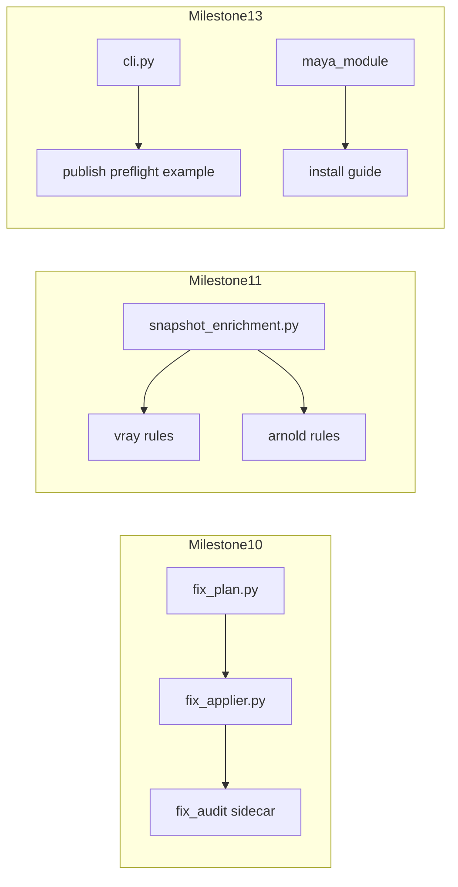
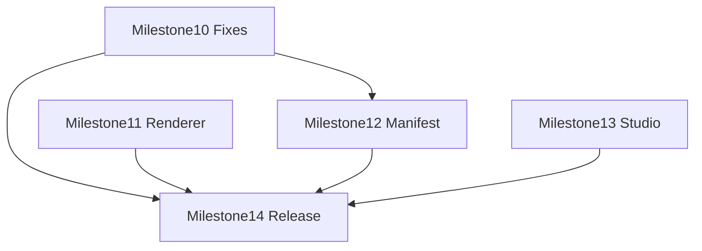

# Maya Pipeline Inspector — v0.2 Development Plan

**Status:** **v0.2.0 shipped** (2026-07-06)  
**Target release:** v0.2.0 — Production Hardening & Studio Readiness  
**Previous plan:** [DEVELOPMENT_PLAN.md](DEVELOPMENT_PLAN.md) (Milestones 0–9, Issues #1–#48)  
**Baseline release:** [CHANGELOG.md](../CHANGELOG.md) — `[0.1.0]`

---

## 1. Document Purpose

This document defines the development path from the shipped **v0.1.0** proof-of-concept to **v0.2.0**. It complements — but does not replace — the master [DEVELOPMENT_PLAN.md](DEVELOPMENT_PLAN.md).

Use this document when:

- planning Milestones 10–14 and Issues #049–#070;
- deciding whether a feature belongs in v0.2 or a later release;
- onboarding contributors after the v0.1 public release.

For architecture, rule schema, snapshot format, and user workflow, refer to the linked documents in [§11 Related Documents](#11-related-documents). This plan describes **what changes in v0.2**, not the full system design.

---

## 2. v0.1 Baseline (Shipped in v0.1.0)

v0.1.0 (Milestone 9 — Demo and Release, Issue #48) delivered a working Texture & Shader Preflight MVP. The following is already in production use:

| Area | Shipped in v0.1 |
|---|---|
| Core validation | `GraphSnapshot`, Maya scanner, JSON rule engine, snapshot enrichment, health score, block flags |
| Rule packs | Common Maya rules; V-Ray and Arnold **info-audit stubs**; five profiles including `ci_headless` |
| Checks | Missing textures, path policy, color space, UDIM, displacement risk, complexity, duplicates, orphans |
| Maya UI | Dockable panel, validate scene/selection, issue table, details, navigation (Select, Hypershade, Copy, Reveal) |
| Safe fixes | Fix planner, Safe Auto-Fix Queue, **`set_attr` applier only**, reference/lock blocking |
| Waivers | Sidecar JSON, load on validate, **Waive** action from issue details |
| Reports | JSON/HTML reports, shader manifest export, **JSON manifest diff** (`tools/diff_manifests.py`) |
| Headless | `python -m pipeline_inspector validate …`, documented exit codes |
| Integration | Deadline submit preflight example ([integrations/deadline_submit_preflight.md](integrations/deadline_submit_preflight.md)) |
| Demo & docs | Broken demo scene, README captures, USER_GUIDE, ARCHITECTURE, RULE_AUTHORING, ADRs 0001–0003 |
| Testing | Unit tests, integration tests for pipeline/CLI/renderer packs, GitHub Actions (no Maya in CI) |

### Known limitations at v0.1 (starting point for v0.2)

From [CHANGELOG.md](../CHANGELOG.md):

- V-Ray and Arnold coverage is MVP-level (info-audit rules), not full renderer policy packs.
- Public CI runs without Autodesk Maya; Maya behavior is validated locally.
- No rule authoring UI; rules are JSON-only.
- No background incremental scan cache.

Additional gaps identified in code review:

- Fix applier supports only `set_attr` ([`fix_applier.py`](../src/pipeline_inspector/maya/fix_applier.py)); `relink_path`, `normalize_path`, and `disable_feature` exist in the fix model but are not applied.
- No fix apply audit log or Export Fix Plan workflow ([ADR 0003](adr/0003-safe-fix-reference-safety-policy.md)).
- Manifest diff is JSON-only; no HTML diff report or `pipeline_inspector diff` CLI subcommand.
- No publish preflight example (Deadline example exists).
- No dedicated Maya module install guide (`maya_module/` exists but is undocumented as a standalone guide).
- Waiver UI supports create-only; no list/revoke/expiry management panel.

---

## 3. Roadmap Realignment (v0.1 Absorbed v0.2–v0.4 Items)

The original [DEVELOPMENT_PLAN.md §27](DEVELOPMENT_PLAN.md) roadmap assumed a slower delivery schedule. v0.1 shipped ahead of that plan:

| Original roadmap version | Planned theme | Actual status after v0.1 |
|---|---|---|
| v0.2 | Safe Fixes and Deadline Preflight | **Mostly shipped** (queue, waivers, headless, Deadline example, profiles) |
| v0.3 | Material Passport and Diff | **Partially shipped** (manifest + JSON diff; HTML diff and UX remain) |
| v0.4 | Optimization and Render Risk | **Partially shipped** (complexity, displacement, optimized texture rules at basic level) |

**Re-scoped v0.2 theme:** **Production Hardening & Studio Readiness** — extend MVP implementations to production-grade depth rather than re-implementing already-shipped features.

Issue **#069** synchronized [DEVELOPMENT_PLAN.md §27](DEVELOPMENT_PLAN.md) with this realignment (see master plan banner and Milestones 10–14 index).

---

## 4. v0.2 Vision — Production Hardening & Studio Readiness

> Make v0.1 features trustworthy and operable in real studio pipelines: complete safe fixes, real renderer policy packs, supervisor change review, and documented install/integration paths.

### v0.2 goals

1. **Expand safe fixes** beyond `set_attr` per [ADR 0003](adr/0003-safe-fix-reference-safety-policy.md): `relink_path`, `normalize_path`, `disable_feature`, with audit trail.
2. **Upgrade renderer packs** from info-audit stubs to production policy rules via snapshot enrichment and V-Ray/Arnold rule packs.
3. **Close pipeline gaps:** publish preflight hook, Maya module install guide, studio custom rules/profile documentation.
4. **Complete change-review workflow:** HTML manifest diff, CLI `diff` subcommand, UI export action.
5. **Improve supervisor workflow:** waiver management UI, high-risk fix confirmation dialog, fix audit visibility.

---

## 5. Goals and Non-Goals for v0.2

### In scope

- Fix applier expansion and fix audit logging.
- Renderer enrichment + policy rules (V-Ray, Arnold).
- Manifest diff HTML + CLI parity.
- Publish hook example and studio integration docs.
- Waiver management and high-risk confirmation UX.
- v0.2.0 release (#070).

### Explicit non-goals (defer to later versions)

| Item | Target version |
|---|---|
| Rule Authoring UI | v0.5 (master plan) |
| RenderMan / Redshift / USD adapters | Future |
| Background incremental scan cache | Future |
| ShotGrid / FTrack integration | Future |
| Automatic maketx / texture generation | Future |
| Headless `--apply-fixes` mode | v0.3 candidate (requires new ADR + strict supervisor policy) |
| `cleanup_orphan` auto-delete | Remains preview-only per ADR 0003 |

---

## 6. Architecture Focus (Modules to Touch)

### Primary modules

| Module | v0.2 change |
|---|---|
| [`src/pipeline_inspector/maya/fix_applier.py`](../src/pipeline_inspector/maya/fix_applier.py) | Add `relink_path`, `normalize_path`, `disable_feature` |
| [`src/pipeline_inspector/core/fix_plan.py`](../src/pipeline_inspector/core/fix_plan.py) | Export fix plan serialization; audit record types |
| [`src/pipeline_inspector/maya/snapshot_enrichment.py`](../src/pipeline_inspector/maya/snapshot_enrichment.py) | V-Ray/Arnold material metadata fields |
| [`src/pipeline_inspector/rules/vray/`](../src/pipeline_inspector/rules/vray/) | Production policy rules |
| [`src/pipeline_inspector/rules/arnold/`](../src/pipeline_inspector/rules/arnold/) | Production policy rules |
| [`src/pipeline_inspector/reports/manifest_diff.py`](../src/pipeline_inspector/reports/manifest_diff.py) | HTML diff report |
| [`src/pipeline_inspector/cli.py`](../src/pipeline_inspector/cli.py) | `diff` subcommand |
| [`src/pipeline_inspector/ui/fix_queue.py`](../src/pipeline_inspector/ui/fix_queue.py) | Export Fix Plan; confirmation dialog hook |
| [`src/pipeline_inspector/ui/main_window.py`](../src/pipeline_inspector/ui/main_window.py) | Waiver manager; manifest diff export |
| [`examples/publish/`](../examples/) | Publish preflight example (new) |
| [`maya_module/`](../maya_module/) | Documented install path |
| [`docs/integrations/`](../docs/integrations/) | Publish preflight doc |

### Dependency graph between milestones

Milestones 10 and 11 can run in parallel. Milestone 12 depends on stable manifest schema. Milestone 13 is largely independent. Milestone 14 is the release gate.

---

## 7. Phases and Milestones 10–14

### Phase A — Safe Fix Hardening (Milestone 10)

**Goal:** Controlled, auditable fixes beyond colorSpace `set_attr`.

**Deliverable:** Artists and TDs can apply medium-risk path fixes and high-risk feature disables with confirmation; every apply attempt is logged.

**Issues:** #049, #050, #051, #052, #053

---

### Phase B — Renderer Policy Packs (Milestone 11)

**Goal:** V-Ray and Arnold rule packs catch real production issues, not only informational audits.

**Deliverable:** Enriched snapshot metadata and at least three blocking/warning rules per renderer, covered by fixture integration tests.

**Issues:** #054, #055, #056, #057, #058

---

### Phase C — Change Review (Milestone 12)

**Goal:** Supervisors compare material health before and after lookdev or publish iterations.

**Deliverable:** HTML manifest diff, CLI `diff` command, optional UI workflow, improved texture freshness coverage.

**Issues:** #059, #060, #061, #062

---

### Phase D — Studio Integration (Milestone 13)

**Goal:** Studios can install, extend, and gate publish without reading source code.

**Deliverable:** Publish preflight example, install guide, studio overrides guide, optional Maya CI workflow.

**Issues:** #063, #064, #065, #066

---

### Phase E — Supervisor UX & Release (Milestone 14)

**Goal:** Waiver and high-risk UX polish; v0.2.0 public release.

**Deliverable:** Waiver manager UI, confirmation dialog, reconciled master roadmap, tagged release.

**Issues:** #067, #068, #069, #070

---

## 8. GitHub Milestones and Issues #049–#070

Issue numbering continues from [DEVELOPMENT_PLAN.md §26](DEVELOPMENT_PLAN.md) (last plan issue: **#48**). Issue **titles** on GitHub use the plan ids `#049`–`#070`; the GitHub issue numbers assigned at backlog creation are **#64–#85** (see [Appendix B](#appendix-b--github-issue-mapping)).

GitHub milestones (open):

| Plan milestone | GitHub milestone | URL |
|---:|---|---|
| 10 | [#12](https://github.com/armasonix/maya-pipeline-inspector/milestone/12) | Safe Fix Expansion and Audit Trail |
| 11 | [#13](https://github.com/armasonix/maya-pipeline-inspector/milestone/13) | Renderer Policy Packs |
| 12 | [#14](https://github.com/armasonix/maya-pipeline-inspector/milestone/14) | Change Review and Manifest Diff UX |
| 13 | [#15](https://github.com/armasonix/maya-pipeline-inspector/milestone/15) | Studio Integration and Install |
| 14 | [#16](https://github.com/armasonix/maya-pipeline-inspector/milestone/16) | Waiver Workflow Polish and v0.2 Release |

Utility script to recreate issues (milestones must exist): [`tools/create_v02_github_backlog.ps1`](../tools/create_v02_github_backlog.ps1)

---

### Milestone 10 — Safe Fix Expansion & Audit Trail

**Theme:** Complete the safe fix pipeline with auditability.

**Deliverable:** Medium/high-risk fixes apply safely; every apply attempt is recorded.

---

#### Issue 49 — Implement `relink_path` fix applier

Labels: `fixes`, `maya`, `safety`  
Depends on: —  
Related: [`fix_applier.py`](../src/pipeline_inspector/maya/fix_applier.py), [`fix_plan.py`](../src/pipeline_inspector/core/fix_plan.py), [ADR 0003](adr/0003-safe-fix-reference-safety-policy.md)

Acceptance criteria:

- `relink_path` fixes update `file` node paths to the planned target path inside a Maya undo chunk.
- Before/after path values are recorded in `AppliedFixRecord`.
- Referenced and locked nodes remain blocked by default.
- Medium-risk fixes require explicit user selection in the Safe Auto-Fix Queue (not included in Apply Safe Fixes).
- Unit tests cover success, blocked referenced node, and missing target node cases.

---

#### Issue 50 — Implement `normalize_path` fix applier

Labels: `fixes`, `maya`, `safety`  
Depends on: —  
Related: [`fix_applier.py`](../src/pipeline_inspector/maya/fix_applier.py), [`texture_paths.json`](../src/pipeline_inspector/rules/common/texture_paths.json)

Acceptance criteria:

- `normalize_path` fixes rewrite local or non-project paths to configured project-root or env-var forms defined in fix params.
- Path normalization respects existing rule/fix param contract in rule JSON.
- Before/after values recorded; undo chunk used.
- Referenced/locked nodes blocked by default.
- Unit tests with mocked `maya.cmds` cover at least one successful normalize and one blocked case.

---

#### Issue 51 — Implement `disable_feature` fix applier with confirmation gate

Labels: `fixes`, `maya`, `safety`, `ui`  
Depends on: #068 (confirmation dialog may land in parallel; applier must respect `high_risk_requires_explicit_confirmation`)  
Related: [`fix_applier.py`](../src/pipeline_inspector/maya/fix_applier.py), [`fix_queue.py`](../src/pipeline_inspector/ui/fix_queue.py)

Acceptance criteria:

- `disable_feature` fixes set the planned attribute (for example displacement enable flag) to the safe disabled state.
- High-risk fixes are blocked until explicit confirmation is acknowledged in UI (or supervisor profile allows).
- Fixes never run via Apply Safe Fixes; only via Apply Selected after confirmation.
- Before/after values and block reasons recorded.
- Unit tests cover applied, blocked-without-confirmation, and referenced-node cases.

---

#### Issue 52 — Persist fix apply audit log (JSON sidecar + report section)

Labels: `fixes`, `reports`, `audit`  
Depends on: #049, #050, #051 (audit schema should cover all fix types)  
Related: [`fix_applier.py`](../src/pipeline_inspector/maya/fix_applier.py), [`json_report.py`](../src/pipeline_inspector/reports/)

Acceptance criteria:

- Each apply session writes a deterministic audit record: timestamp (UTC), scene path, profile id, fix records (fix_id, rule_id, fix_type, target, before, after, applied/blocked, block_reasons, undo chunk name).
- Audit log persisted as `{scene_stem}.pipeline_inspector_fix_audit.json` beside the scene (or path override API).
- Validation JSON report includes an optional `fix_audit` section when fixes were applied in-session.
- Reloading audit log round-trips through JSON schema tests.
- Headless validate does not write fix audit unless an explicit future apply mode is added (out of v0.2 scope).

---

#### Issue 53 — Add Export Fix Plan (UI + optional CLI flag)

Labels: `fixes`, `ui`, `cli`  
Depends on: —  
Related: [`fix_plan.py`](../src/pipeline_inspector/core/fix_plan.py), [`fix_queue.py`](../src/pipeline_inspector/ui/fix_queue.py), [`main_window.py`](../src/pipeline_inspector/ui/main_window.py)

Acceptance criteria:

- UI button **Export Fix Plan** writes deterministic JSON of planned fix actions (no scene mutation).
- Export includes fix metadata required by ADR 0003: risk, target, before/after, reference/lock status, block reasons.
- Optional CLI flag on validate (for example `--export-fix-plan path.json`) exports the same structure from headless fix planning when fixes exist.
- Export output is stable (sorted keys, stable ordering) for diffing in CI or review.
- Unit test asserts round-trip structure and determinism.

---

### Milestone 11 — Renderer Policy Packs (V-Ray & Arnold)

**Theme:** Real renderer-specific production policy, not info-only stubs.

**Deliverable:** Blocking/warning V-Ray and Arnold rules backed by enriched snapshot fields.

---

#### Issue 54 — Extend snapshot enrichment for V-Ray material metadata

Labels: `maya`, `scanner`, `vray`  
Depends on: —  
Related: [`snapshot_enrichment.py`](../src/pipeline_inspector/maya/snapshot_enrichment.py), [`SNAPSHOT_SCHEMA.md`](SNAPSHOT_SCHEMA.md)

Acceptance criteria:

- Material snapshots expose V-Ray-specific metadata needed for policy rules (for example: plugin node presence, subdivision/displacement flags, texture count, key limit attrs).
- New fields documented in [SNAPSHOT_SCHEMA.md](SNAPSHOT_SCHEMA.md) with examples.
- Enrichment is optional-safe when V-Ray nodes are absent (no scan failure).
- Unit or fixture tests validate enriched JSON shape for a V-Ray material fixture snapshot.

---

#### Issue 55 — Add V-Ray production policy rules

Labels: `rules`, `vray`  
Depends on: #054  
Related: [`rules/vray/renderer_health.json`](../src/pipeline_inspector/rules/vray/renderer_health.json)

Acceptance criteria:

- At least three new enabled rules with mixed severity (warning and/or error), not info-only.
- Rules cover production concerns such as: missing V-Ray plugin node in scene when V-Ray materials present, displacement policy, texture/graph budget thresholds (exact ids documented in rule pack).
- Rules use enrichment fields from #054, not only generic `texture_nodes` / `displacement_nodes` lists.
- `tools/validate_rules.py` passes for the updated pack.
- Profile overrides in `publish_strict` / `deadline_critical` can elevate selected rules to block publish/deadline where appropriate.

---

#### Issue 56 — Extend snapshot enrichment for Arnold material metadata

Labels: `maya`, `scanner`, `arnold`  
Depends on: —  
Related: [`snapshot_enrichment.py`](../src/pipeline_inspector/maya/snapshot_enrichment.py), [`SNAPSHOT_SCHEMA.md`](SNAPSHOT_SCHEMA.md)

Acceptance criteria:

- Material snapshots expose Arnold-specific metadata (for example: aiStandardSurface key attrs, displacement linkage, texture count, stand-in/proxy flags if applicable).
- Fields documented in [SNAPSHOT_SCHEMA.md](SNAPSHOT_SCHEMA.md).
- Safe degradation when Arnold nodes are absent.
- Fixture test for enriched Arnold material snapshot shape.

---

#### Issue 57 — Add Arnold production policy rules

Labels: `rules`, `arnold`  
Depends on: #056  
Related: [`rules/arnold/renderer_health.json`](../src/pipeline_inspector/rules/arnold/renderer_health.json)

Acceptance criteria:

- At least three new enabled rules with mixed severity (warning and/or error).
- Rules use enrichment fields from #056.
- `tools/validate_rules.py` passes.
- Integration test loads pack against fixture snapshot and asserts expected fail/pass counts.

---

#### Issue 58 — Renderer policy pack fixture tests

Labels: `testing`, `integration`  
Depends on: #055, #057  
Related: [`tests/integration/test_renderer_rule_packs.py`](../tests/integration/test_renderer_rule_packs.py)

Acceptance criteria:

- New JSON fixtures under `tests/fixtures/snapshots/` for V-Ray and Arnold policy scenarios.
- Integration tests assert rule ids, severities, and block flags without launching Maya.
- Tests run in default GitHub Actions CI job.
- README or test docstring explains how to add renderer fixture cases.

---

### Milestone 12 — Change Review & Manifest Diff UX

**Theme:** Supervisor-friendly before/after material health comparison.

**Deliverable:** JSON and HTML manifest diff via CLI and UI.

---

#### Issue 59 — HTML manifest diff report template

Labels: `reports`, `html`  
Depends on: —  
Related: [`manifest_diff.py`](../src/pipeline_inspector/reports/manifest_diff.py), [`html_report.py`](../src/pipeline_inspector/reports/html_report.py)

Acceptance criteria:

- HTML diff report renders new, resolved, and changed issues/material entries from manifest diff payload.
- Visual language matches v0.1 HTML validation report (typography, severity grouping, full-width layout).
- Output is self-contained (embedded CSS, no external CDN required).
- Snapshot/unit test locks key HTML sections for a fixed fixture diff.

---

#### Issue 60 — Add `pipeline_inspector diff` CLI subcommand

Labels: `cli`, `headless`  
Depends on: #059 (for `--html` output)  
Related: [`cli.py`](../src/pipeline_inspector/cli.py), [`tools/diff_manifests.py`](../tools/diff_manifests.py)

Acceptance criteria:

- `python -m pipeline_inspector diff OLD.json NEW.json` writes JSON diff to stdout or `--out`.
- `--html PATH` writes HTML diff report using #059 template.
- Exit code 0 on success; non-zero on invalid inputs with clear stderr message.
- `tools/diff_manifests.py` delegates to shared implementation or documents deprecation path.
- Unit tests cover JSON and HTML output paths.

---

#### Issue 61 — UI action: export manifest diff (pick baseline manifest)

Labels: `ui`, `reports`  
Depends on: #59, #60  
Related: [`main_window.py`](../src/pipeline_inspector/ui/main_window.py), [`export_actions.py`](../src/pipeline_inspector/maya/export_actions.py)

Acceptance criteria:

- UI action lets user pick a baseline manifest JSON and exports diff against current validation manifest.
- User can export JSON and HTML diff via file dialog or predictable default paths beside the scene.
- Action is read-only (no scene mutation).
- Wired through Maya export callbacks with unit test for callback wiring (mocked UI).

---

#### Issue 62 — Improve texture freshness checks and fixture coverage

Labels: `rules`, `testing`  
Depends on: —  
Related: [`texture_freshness.json`](../src/pipeline_inspector/rules/common/texture_freshness.json), [USER_GUIDE.md](USER_GUIDE.md)

Acceptance criteria:

- `texture_version_latest` check handles edge cases documented in tests (multiple version siblings, missing version token, single version folder).
- [USER_GUIDE.md](USER_GUIDE.md) documents limitation: filesystem-based version detection only (no publish DB in v0.2).
- At least two new unit fixtures for freshness pass/fail scenarios.
- No breaking change to existing rule id without migration note in CHANGELOG.

---

### Milestone 13 — Studio Integration & Install

**Theme:** Documented paths for install, custom rules, and publish gates.

**Deliverable:** Studios can adopt the tool without reading implementation details.

---

#### Issue 63 — Publish preflight hook example + documentation

Labels: `integration`, `docs`  
Depends on: —  
Related: [`examples/deadline/submit_preflight.py`](../examples/deadline/submit_preflight.py), [deadline_submit_preflight.md](integrations/deadline_submit_preflight.md)

Acceptance criteria:

- `examples/publish/submit_preflight.py` mirrors Deadline example structure for publish-time gating.
- Uses `publish_strict` (or configurable) profile and maps exit code `1` to publish block.
- New doc: `docs/integrations/publish_submit_preflight.md` with usage, exit codes, integration snippet.
- Unit test validates example script imports and exit-code mapping (mocked subprocess where needed).

---

#### Issue 64 — Maya module install guide (`maya_module/`)

Labels: `docs`, `maya`  
Depends on: —  
Related: [`maya_module/pipeline_inspector.mod`](../maya_module/pipeline_inspector.mod), [`maya_module/scripts/`](../maya_module/scripts/)

Acceptance criteria:

- New doc: `docs/MAYA_INSTALL.md` covering `MAYA_MODULE_PATH`, editable pip install alternative, shelf, menu bootstrap.
- Documents supported Maya versions tested by maintainer (best-effort matrix).
- Links from [USER_GUIDE.md](USER_GUIDE.md) and README install section.
- Verify steps against actual `userSetup.py` / bootstrap script behavior.

---

#### Issue 65 — Studio custom rules and profile overrides guide

Labels: `docs`, `rules`  
Depends on: —  
Related: [RULE_AUTHORING.md](RULE_AUTHORING.md), [`rule_loader.py`](../src/pipeline_inspector/core/rule_loader.py), [`validation_pipeline.py`](../src/pipeline_inspector/maya/validation_pipeline.py)

Acceptance criteria:

- New doc section or `docs/STUDIO_OVERRIDES.md` explains: `--extra-rules`, custom profile JSON, `extra_rule_paths` in UI pipeline, rule pack folder layout.
- Worked example: studio rule file + profile override disabling/enabling a rule and changing `block_publish`.
- Cross-links to [RULE_AUTHORING.md](RULE_AUTHORING.md) and [ADR 0002](adr/0002-renderer-adapter-boundary.md).
- Example paths use repo `examples/` or `tests/fixtures` conventions.

---

#### Issue 66 — Optional GitHub Actions Maya integration job (workflow_dispatch)

Labels: `ci`, `maya`  
Depends on: —  
Related: [`.github/workflows/ci.yml`](../.github/workflows/ci.yml)

Acceptance criteria:

- New workflow or job triggered by `workflow_dispatch` only (not on every PR).
- Job runs `pytest tests/integration` with `mayapy` when `MAYA_PY` secret/path is configured; skips gracefully with message when Maya unavailable.
- Document in `docs/MAYA_INSTALL.md` or CI README comment how maintainers run it locally/on self-hosted runner.
- Default public CI remains Maya-free.

---

### Milestone 14 — Waiver Workflow Polish & v0.2 Release

**Theme:** Supervisor exceptions and public v0.2.0 release.

**Deliverable:** Manageable waivers, high-risk confirmation UX, reconciled roadmap, tagged release.

---

#### Issue 67 — Waiver management UI (view active waivers, revoke, expiry warning)

Labels: `waivers`, `ui`  
Depends on: —  
Related: [`waivers.py`](../src/pipeline_inspector/core/waivers.py), [`commands.py`](../src/pipeline_inspector/maya/commands.py), [`main_window.py`](../src/pipeline_inspector/ui/main_window.py)

Acceptance criteria:

- UI panel or dialog lists active waivers from scene sidecar with rule id, target, author, expiry.
- User can revoke a waiver (removes or marks inactive in sidecar); revalidate reflects change.
- Expired waivers show warning state and are ignored by engine (existing behavior preserved).
- Waive action still works from issue details (no regression).
- Unit tests for revoke/load round-trip on waiver sidecar.

---

#### Issue 68 — High-risk fix confirmation dialog (supervisor profile gate)

Labels: `fixes`, `ui`, `safety`  
Depends on: —  
Related: [`fix_queue.py`](../src/pipeline_inspector/ui/fix_queue.py), [`ui_launcher.py`](../src/pipeline_inspector/maya/ui_launcher.py), [ADR 0003](adr/0003-safe-fix-reference-safety-policy.md)

Acceptance criteria:

- Applying high-risk or `requires_supervisor` fixes opens explicit confirmation dialog summarizing target, before/after, risk.
- Cancel leaves scene unchanged; confirm proceeds inside undo chunk.
- `supervisor_full` profile may allow batch confirm; stricter profiles require per-fix confirm.
- Confirmation label in fix queue updates to reflect pending risky count (existing label enhanced, not replaced).
- Unit test for confirm/cancel callback wiring.

---

#### Issue 69 — Reconcile DEVELOPMENT_PLAN §27 roadmap with shipped v0.1 / planned v0.2

Labels: `docs`  
Depends on: —  
Related: [DEVELOPMENT_PLAN.md](DEVELOPMENT_PLAN.md), this document

Acceptance criteria:

- [DEVELOPMENT_PLAN.md](DEVELOPMENT_PLAN.md) §27 updated: v0.1 = shipped MVP; v0.2 = Production Hardening (this plan); v0.3+ adjusted for remaining passport/complexity/rule-UI items.
- Banner at top of DEVELOPMENT_PLAN links to this document.
- New §26 appendix or §26 continuation lists Milestones 10–14 with link here (no duplicate issue bodies).
- [ARCHITECTURE.md](ARCHITECTURE.md) status line updated to reference v0.2 in progress.

---

#### Issue 70 — Prepare v0.2 public release

Labels: `release`  
Depends on: #049–#069 (or documented deferrals in CHANGELOG)  
Related: [CHANGELOG.md](../CHANGELOG.md), [`pyproject.toml`](../pyproject.toml)

Acceptance criteria:

- Version bumped to `0.2.0` in `pyproject.toml` and package `__version__` if applicable.
- [CHANGELOG.md](../CHANGELOG.md) `[0.2.0]` section lists added/changed/fixed items.
- [USER_GUIDE.md](USER_GUIDE.md) reflects v0.2 features (fix types, waiver manager, manifest diff, install link).
- Full test suite green: pytest, ruff, mypy, `tools/validate_rules.py`.
- Git tag `v0.2.0` and GitHub Release published with release notes summarizing theme.
- Demo scene validates locally in Maya (manual checklist item documented in release notes).

---

## 9. Testing Strategy (Delta from DEVELOPMENT_PLAN §28)

v0.2 follows the test pyramid in [DEVELOPMENT_PLAN.md §28](DEVELOPMENT_PLAN.md) with these additions:

| Area | v0.2 requirement |
|---|---|
| Fix appliers | Unit tests with mocked `maya.cmds` ([`test_maya_fix_applier.py`](../tests/unit/test_maya_fix_applier.py) pattern) for each new fix type |
| Fix audit log | JSON round-trip schema tests; determinism tests |
| Export fix plan | Structure and stable ordering tests |
| Renderer rules | New fixtures in `tests/fixtures/snapshots/`; integration tests without Maya |
| Manifest HTML diff | HTML snapshot tests for fixed diff payload |
| Publish hook | Test exit-code mapping like [`test_deadline_submit_preflight_example.py`](../tests/unit/test_deadline_submit_preflight_example.py) |
| Waiver manager | Sidecar revoke/load unit tests |
| Maya CI | Optional `workflow_dispatch` only (#066); not required for contributor PRs |

### Manual release checklist (Milestone 14)

- Open demo scene in Maya; run Validate Scene with `publish_strict` and `deadline_critical`.
- Apply one safe fix and one confirmed high-risk fix; verify undo and audit log file.
- Export manifest diff JSON + HTML against bundled demo manifest artifact.
- Run publish and Deadline preflight examples against demo scene (mayapy path documented).

---

## 10. v0.2 Release Criteria

v0.2.0 is ready when:

- [x] Issues **#049–#069** are closed, or deferrals are explicit in CHANGELOG with rationale.
- [x] Issue **#070** release checklist is complete.
- [ ] No regression in headless exit codes (`0`, `1`, `2`, `3`, `4`).
- [ ] Demo scene [`examples/broken_scene/`](../examples/broken_scene/) still produces expected issue categories.
- [ ] [DEVELOPMENT_PLAN.md §27](DEVELOPMENT_PLAN.md) reflects realigned roadmap (#069).
- [ ] All new user-facing behavior documented in USER_GUIDE and/or integration docs.

---

## 11. Related Documents

| Document | Purpose |
|---|---|
| [DEVELOPMENT_PLAN.md](DEVELOPMENT_PLAN.md) | Master plan, Milestones 0–9, architecture and v0.1 roadmap |
| [ARCHITECTURE.md](ARCHITECTURE.md) | Layer diagram, snapshot-first design, fix safety policy summary |
| [USER_GUIDE.md](USER_GUIDE.md) | Artist/TD workflow, profiles, UI actions |
| [RULE_AUTHORING.md](RULE_AUTHORING.md) | JSON rule schema and examples |
| [SNAPSHOT_SCHEMA.md](SNAPSHOT_SCHEMA.md) | GraphSnapshot field reference (update in #054, #056) |
| [CHANGELOG.md](../CHANGELOG.md) | Release history |
| [adr/0001-snapshot-first-core.md](adr/0001-snapshot-first-core.md) | Snapshot-first architecture decision |
| [adr/0002-renderer-adapter-boundary.md](adr/0002-renderer-adapter-boundary.md) | Renderer adapter boundary |
| [adr/0003-safe-fix-reference-safety-policy.md](adr/0003-safe-fix-reference-safety-policy.md) | Safe fix and reference safety policy |
| [integrations/deadline_submit_preflight.md](integrations/deadline_submit_preflight.md) | Deadline preflight integration |
| [integrations/publish_submit_preflight.md](integrations/publish_submit_preflight.md) | Publish preflight integration |
| [MAYA_INSTALL.md](MAYA_INSTALL.md) | Maya module and pip install |
| [STUDIO_OVERRIDES.md](STUDIO_OVERRIDES.md) | Studio custom rules and profile overrides |

### Documents to update during v0.2 implementation

- [DEVELOPMENT_PLAN.md](DEVELOPMENT_PLAN.md) — §27 + banner (#069)
- [USER_GUIDE.md](USER_GUIDE.md) — fix types, waivers, manifest diff, install (#064, #067, #070)
- [ARCHITECTURE.md](ARCHITECTURE.md) — fix audit, renderer enrichment (#052, #054, #056, #069)
- [CHANGELOG.md](../CHANGELOG.md) — `[0.2.0]` entry (#070)
- [README.md](../README.md) — brief v0.2 theme after release (#070)

---

## Appendix A — Issue Index (#049–#070)

| Issue | Milestone | Title |
|------:|-----------|-------|
| 49 | 10 | Implement `relink_path` fix applier |
| 50 | 10 | Implement `normalize_path` fix applier |
| 51 | 10 | Implement `disable_feature` fix applier with confirmation gate |
| 52 | 10 | Persist fix apply audit log |
| 53 | 10 | Add Export Fix Plan (UI + CLI) |
| 54 | 11 | Extend snapshot enrichment for V-Ray |
| 55 | 11 | Add V-Ray production policy rules |
| 56 | 11 | Extend snapshot enrichment for Arnold |
| 57 | 11 | Add Arnold production policy rules |
| 58 | 11 | Renderer policy pack fixture tests |
| 59 | 12 | HTML manifest diff report template |
| 60 | 12 | Add `pipeline_inspector diff` CLI subcommand |
| 61 | 12 | UI export manifest diff |
| 62 | 12 | Improve texture freshness checks |
| 63 | 13 | Publish preflight hook example + docs |
| 64 | 13 | Maya module install guide |
| 65 | 13 | Studio custom rules and profile overrides guide |
| 66 | 13 | Optional Maya integration CI job |
| 67 | 14 | Waiver management UI |
| 68 | 14 | High-risk fix confirmation dialog |
| 69 | 14 | Reconcile DEVELOPMENT_PLAN §27 |
| 70 | 14 | Prepare v0.2 public release |

---

## Appendix B — GitHub Issue Mapping

Plan ids in issue titles map to GitHub issues as follows:

| Plan id | GitHub issue | Title |
|--------:|-------------:|-------|
| 049 | [#64](https://github.com/armasonix/maya-pipeline-inspector/issues/64) | Implement `relink_path` fix applier |
| 050 | [#65](https://github.com/armasonix/maya-pipeline-inspector/issues/65) | Implement `normalize_path` fix applier |
| 051 | [#66](https://github.com/armasonix/maya-pipeline-inspector/issues/66) | Implement `disable_feature` fix applier with confirmation gate |
| 052 | [#67](https://github.com/armasonix/maya-pipeline-inspector/issues/67) | Persist fix apply audit log |
| 053 | [#68](https://github.com/armasonix/maya-pipeline-inspector/issues/68) | Add Export Fix Plan (UI + CLI) |
| 054 | [#69](https://github.com/armasonix/maya-pipeline-inspector/issues/69) | Extend snapshot enrichment for V-Ray |
| 055 | [#70](https://github.com/armasonix/maya-pipeline-inspector/issues/70) | Add V-Ray production policy rules |
| 056 | [#71](https://github.com/armasonix/maya-pipeline-inspector/issues/71) | Extend snapshot enrichment for Arnold |
| 057 | [#72](https://github.com/armasonix/maya-pipeline-inspector/issues/72) | Add Arnold production policy rules |
| 058 | [#73](https://github.com/armasonix/maya-pipeline-inspector/issues/73) | Renderer policy pack fixture tests |
| 059 | [#74](https://github.com/armasonix/maya-pipeline-inspector/issues/74) | HTML manifest diff report template |
| 060 | [#75](https://github.com/armasonix/maya-pipeline-inspector/issues/75) | Add `pipeline_inspector diff` CLI subcommand |
| 061 | [#76](https://github.com/armasonix/maya-pipeline-inspector/issues/76) | UI export manifest diff |
| 062 | [#77](https://github.com/armasonix/maya-pipeline-inspector/issues/77) | Improve texture freshness checks |
| 063 | [#78](https://github.com/armasonix/maya-pipeline-inspector/issues/78) | Publish preflight hook example + docs |
| 064 | [#79](https://github.com/armasonix/maya-pipeline-inspector/issues/79) | Maya module install guide |
| 065 | [#80](https://github.com/armasonix/maya-pipeline-inspector/issues/80) | Studio custom rules and profile overrides guide |
| 066 | [#81](https://github.com/armasonix/maya-pipeline-inspector/issues/81) | Optional Maya integration CI job |
| 067 | [#82](https://github.com/armasonix/maya-pipeline-inspector/issues/82) | Waiver management UI |
| 068 | [#83](https://github.com/armasonix/maya-pipeline-inspector/issues/83) | High-risk fix confirmation dialog |
| 069 | [#84](https://github.com/armasonix/maya-pipeline-inspector/issues/84) | Reconcile DEVELOPMENT_PLAN §27 |
| 070 | [#85](https://github.com/armasonix/maya-pipeline-inspector/issues/85) | Prepare v0.2 public release |
