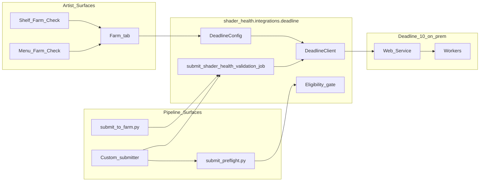
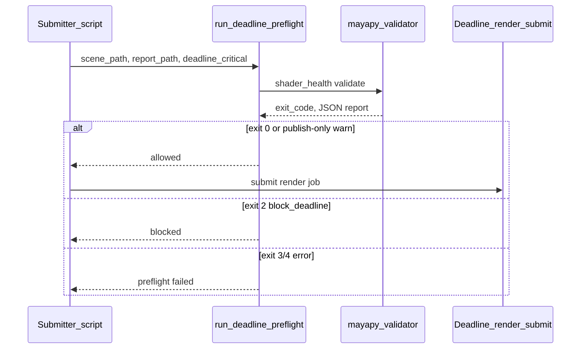
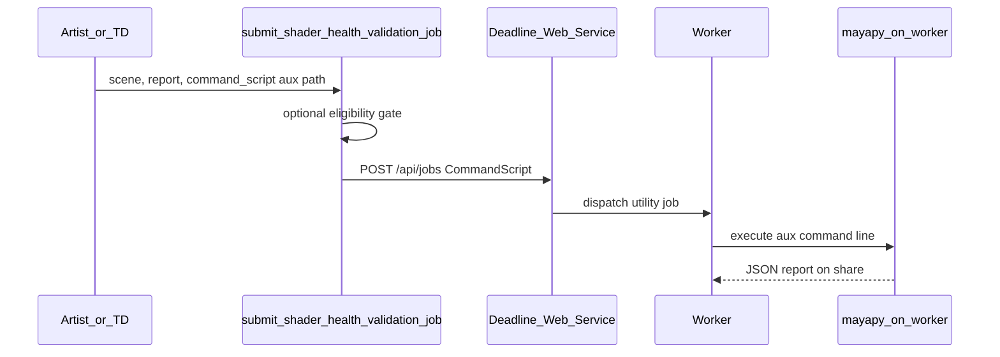

# Deadline 10 integration guide (v0.4)

Studio guide for connecting **Maya Shader Health Inspector** to **Thinkbox Deadline 10 on-prem** via the Web Service REST API. Covers Web Service setup, routing (pool/group), artist GUI workflows, headless preflight, farm eligibility, and CommandScript utility submit.

**Package:** `shader_health.integrations.deadline`  
**Default Web Service URL:** `http://localhost:8081`  
**Default validation profile:** `deadline_critical`

Related docs:

- [USER_GUIDE.md](../USER_GUIDE.md) — artist-facing **Farm Submit** workflow
- [MAYA_INSTALL.md](../MAYA_INSTALL.md) — menu/shelf entrypoints
- [ARCHITECTURE.md](../ARCHITECTURE.md) — shared validation pipeline

---

## What v0.4 ships

| Layer | Module / surface | Purpose |
| --- | --- | --- |
| Config | `DeadlineConfig` | Env vars + JSON for API URL, profile, `mayapy`, queue/pool/group |
| REST client | `DeadlineClient` | `ping`, `get_job`, `submit_job` |
| Preflight | `run_deadline_preflight()` | Headless `mayapy` validation gate |
| Eligibility | `evaluate_farm_submit_eligibility()` | Scene state + validation matrix (#099) |
| Submit API | `submit_shader_health_validation_job()` | CommandScript / MayaBatch utility jobs (#100) |
| Maya GUI | **Farm** tab (#101) | Connection status, preflight, submit |
| Shortcuts | Menu + shelf **Shader Health Farm Check** (#102) | Open Farm tab + run preflight |

The example scripts under `examples/deadline/` are thin CLI wrappers around the shared package.

---

## Integration overview



All paths call the same validation pipeline (`validation_pipeline` / headless CLI) — GUI and farm hooks do not fork rule evaluation.

---

## Deadline Web Service setup

Shader Health talks to Deadline through the **standalone Web Service** (`deadlinewebservice`), not directly to workers.

### Prerequisites

1. **Deadline Repository** reachable from the Web Service host.
2. **Web Service process** running on a stable host (often a small utility VM or the repository server).
3. **Firewall** allows artists and pipeline hosts to reach the configured HTTP port (default **8081**).
4. **Shared paths** for `AuxFiles` (CommandScript aux `.txt`) visible on the **Web Service host**, not only on the artist workstation.

Thinkbox references:

- [Web Service](https://docs.thinkboxsoftware.com/products/deadline/10.4/1_User%20Manual/manual/web-service.html)
- [REST overview](https://docs.thinkboxsoftware.com/products/deadline/10.4/1_User%20Manual/manual/rest-overview.html)

### Repository configuration

Global Web Service settings live in **Repository Options → Web Service Settings** (port, TLS, authentication). Per-machine overrides can be set in `deadline.ini` on the Web Service host ([client Web Service settings](https://docs.thinkboxsoftware.com/products/deadline/10.4/1_User%20Manual/manual/client-config.html#client-config-web-service-ref-label)).

### Default port and health check

Thinkbox defaults the unsecured port to **8081**. Shader Health uses the same default in `DeadlineConfig`.

**Browser smoke test** (legacy landing page):

```text
http://<web-service-host>:8081/
```

Expected response: `This is the Deadline web service!`

**API smoke test** (what the Farm tab uses):

```python
from shader_health.integrations.deadline import DeadlineClient, DeadlineConfig

client = DeadlineClient(DeadlineConfig(api_url="http://farm-controller:8081"))
assert client.ping()  # GET /api/jobs?IdOnly=true → HTTP 200
```

Set the studio default for artists:

```text
SHADER_HEALTH_DEADLINE_API_URL=http://farm-controller:8081
```

### Windows namespace reservation

On Windows, the Web Service user may need an HTTP.SYS URL reservation (see Thinkbox Web Service FAQ). Example:

```text
netsh http add urlacl url=http://*:8081/ user=DOMAIN\deadline_svc
```

### Linux file limits

Thinkbox recommends `ulimit -n 200000` on Linux Web Service hosts under heavy farm load.

---

## Authentication and TLS

Thinkbox recommends running the REST API **with authentication enabled** on any network beyond a closed facility LAN. TLS and client certificates are configured during Web Service installation ([Standalone Python API — Authenticating](https://docs.thinkboxsoftware.com/products/deadline/10.2/1_User%20Manual/manual/standalone-python.html#authenticating)).

### v0.4 client behavior

`DeadlineClient` in v0.4 issues plain HTTP requests **without** built-in Basic auth or TLS client certificates. It is intended for:

- closed-studio LANs with authentication **disabled**, or
- deployments where a **reverse proxy** terminates TLS/auth and exposes an internal HTTP endpoint to trusted pipeline hosts.

If your Web Service returns **HTTP 401**, the Farm tab shows **Offline** and submit is blocked until connectivity is fixed. Studios requiring authenticated REST should either:

- place Shader Health clients on an authenticated proxy segment and point `SHADER_HEALTH_DEADLINE_API_URL` at the proxy, or
- extend `DeadlineClient` transport with studio auth headers (future enhancement).

Document your facility's Web Service URL, TLS port, and credential policy in the studio JSON config (see below); do not commit secrets to scene or repo files.

---

## Configuration

Studios load defaults from environment variables or a JSON file.

### Environment variables (`SHADER_HEALTH_DEADLINE_*`)

| Variable | Purpose |
| --- | --- |
| `SHADER_HEALTH_DEADLINE_API_URL` | Web Service base URL (default `http://localhost:8081`) |
| `SHADER_HEALTH_DEADLINE_TIMEOUT` | HTTP timeout in seconds |
| `SHADER_HEALTH_DEADLINE_PROFILE_ID` | Packaged profile id (default `deadline_critical`) |
| `SHADER_HEALTH_DEADLINE_PROFILE_PATH` | Optional explicit profile JSON path |
| `SHADER_HEALTH_DEADLINE_MAYAPY` | `mayapy` executable for scene validation |
| `SHADER_HEALTH_DEADLINE_REPO_ROOT` | Working directory for validator subprocess / `StartupDirectory` |
| `SHADER_HEALTH_DEADLINE_QUEUE` | Fallback routing name written to `JobInfo.Pool` when `pool` is unset |
| `SHADER_HEALTH_DEADLINE_POOL` | Primary pool name → `JobInfo.Pool` |
| `SHADER_HEALTH_DEADLINE_GROUP` | Group name → `JobInfo.Group` |
| `SHADER_HEALTH_DEADLINE_USER_NAME` | Optional `JobInfo.UserName` override for submitted utility jobs |

### JSON config example

Deploy per show or site (path is studio-specific):

```json
{
  "api_url": "http://deadline-web:8081",
  "profile_id": "deadline_critical",
  "mayapy": "C:/Program Files/Autodesk/Maya2026/bin/mayapy.exe",
  "repo_root": "//farm/share/tools/maya-shader-health-inspector",
  "pool": "utility",
  "group": "lookdev",
  "user_name": "pipeline_td",
  "timeout_seconds": 30
}
```

Load in Python:

```python
from pathlib import Path

from shader_health.integrations.deadline import DeadlineConfig

config = DeadlineConfig.from_env()
# or
config = DeadlineConfig.from_json(Path("/show/config/shader_health/deadline.json"))
profile_path = config.resolved_profile_path()
```

---

## Pool, group, and queue mapping

`submit_shader_health_validation_job()` builds `JobInfo` through `_base_job_info()`:

| `DeadlineConfig` field | `JobInfo` key | Notes |
| --- | --- | --- |
| `pool` | `Pool` | Preferred routing target |
| `queue` | `Pool` | Used **only when** `pool` is unset (legacy alias) |
| `group` | `Group` | Worker group restriction |
| `user_name` | `UserName` | Overrides the Web Service process user on the job record |

Example utility job fragment:

```json
{
  "Name": "Shader Health | hero_lighting.ma",
  "Plugin": "CommandScript",
  "Frames": "0",
  "ChunkSize": 1,
  "Pool": "utility",
  "Group": "lookdev",
  "UserName": "pipeline_td"
}
```

Map facility policy in the JSON config:

| Studio intent | Config |
| --- | --- |
| Utility validation on lookdev workers | `"pool": "utility"`, `"group": "lookdev"` |
| Per-show queue name legacy | `"queue": "seq010"` (writes `Pool=seq010` when `pool` omitted) |
| Attribute jobs to pipeline service account | `"user_name": "shader_health_svc"` |

---

## Artist GUI workflow (Maya panel)

### Farm tab (#101)

Open **Shader Health Inspector → Farm**:

| Step | Action |
| --- | --- |
| 1 | **Refresh Connection** — ping Web Service; **Status** shows **Online** / **Offline** |
| 2 | **Validate Scene** on the Validate tab (or run preflight from shortcut below) |
| 3 | **Run Farm Preflight** — validates with `deadline_critical` + eligibility gate |
| 4 | **Submit to Farm** — queues CommandScript utility job when allowed |

The tab persists last JSON report path and last submitted job id.

### Menu and shelf shortcuts (#102)

| Entrypoint | Behavior |
| --- | --- |
| **Shader Health → Shader Health Farm Check** | Opens panel on **Farm** tab and runs preflight |
| Shelf **Shader Health Farm Check** | Same as menu shortcut |

See [USER_GUIDE.md — Farm Submit](../USER_GUIDE.md#farm-submit) for the artist checklist.

---

## Headless automation

### Preflight-only gate (no job submit)

Use before an existing render submit hook approves a scene.



Example CLI:

```bash
mayapy examples/deadline/submit_preflight.py \
  D:/show/seq010/shot020/lighting/shot020_lighting.ma \
  --report D:/show/seq010/shot020/reports/shader_health_deadline.json \
  --profile D:/show/config/shader_health/profiles/deadline_critical.json \
  --repo-root D:/tools/maya-shader-health-inspector \
  --mayapy "C:/Program Files/Autodesk/Maya2026/bin/mayapy.exe" \
  --renderer vray
```

### Farm validation utility job (worker-side validate)

Use when validation must run on a farm worker (same scene paths as render jobs).



Example CLI:

```bash
python examples/deadline/submit_to_farm.py D:/show/scene.ma \
  --report D:/show/reports/shader_health_farm.json \
  --command-script //farm/share/deadline/shader_health_command.txt \
  --check-eligibility
```

### Custom submitter integration

```python
from pathlib import Path

from shader_health.integrations.deadline import (
    DeadlineConfig,
    FarmSceneState,
    FarmValidationResult,
    evaluate_farm_submit_eligibility,
    run_deadline_preflight,
)

config = DeadlineConfig.from_env()

# 1) Local preflight before render submit
result = run_deadline_preflight(
    scene_path=Path(scene_path),
    report_path=Path(report_path),
    profile_path=config.resolved_profile_path(),
    mayapy=config.mayapy,
    repo_root=config.repo_root,
    extra_args=("--renderer", "vray"),
)
if not result.allowed:
    raise RuntimeError(f"Deadline blocked. Report: {result.report_path}")

# 2) Optional eligibility with scene signals
eligibility = evaluate_farm_submit_eligibility(
    FarmValidationResult.from_json_report(report_payload),
    FarmSceneState(scene_saved=True, renderer_plugin_loaded=True),
)
if not eligibility.allowed:
    raise RuntimeError(f"Farm blocked: {eligibility.reasons}")

# 3) Continue with normal Deadline render submission
```

---

## Critical validation profile

Preflight uses a **Deadline-critical** profile. A typical `deadline_critical` profile sets `block_deadline=true` on farm-breaking rules (missing textures, unreadable paths, etc.):

```json
{
  "id": "deadline_critical",
  "display_name": "Deadline Critical",
  "rule_overrides": {
    "common.texture.missing": {
      "block_deadline": true
    }
  }
}
```

Tune per show in packaged profiles or studio overrides — see [RULE_AUTHORING.md](../RULE_AUTHORING.md).

---

## Exit code mapping

| Validator exit | Meaning |
| --- | --- |
| `0` | No blocking issues |
| `1` | Publish-blocking issues |
| `2` | Deadline/farm-blocking issues |
| `3` | Runtime/tool error |
| `4` | Invalid config/profile/rules |

| Preflight decision | When |
| --- | --- |
| Allow submit | Exit `0`; publish-only issues may warn |
| Block Deadline | Exit `2` / `block_deadline=true` |
| Block (unsafe) | Exit `3` or `4` — do not ignore |

---

## Farm eligibility gate (#099)

Combine validator output with Maya scene readiness before enabling **Submit to Farm**:

```python
from shader_health.integrations.deadline import (
    FarmSceneState,
    FarmValidationResult,
    evaluate_farm_submit_eligibility,
)

validation = FarmValidationResult.from_json_report(report_payload)
scene_state = FarmSceneState(scene_saved=True, renderer_plugin_loaded=True)
eligibility = evaluate_farm_submit_eligibility(validation, scene_state)
```

### Eligibility matrix

| Signal | Decision | Farm allowed |
| --- | --- | --- |
| Validator exit `3` or `4` | Block | No |
| `scene_saved=false` | Block | No |
| `renderer_plugin_loaded=false` | Block | No |
| `block_deadline=true` or exit `2` | Block | No |
| `block_publish=true` only | Warn | Yes |
| Clean validation + scene ready | Allow | Yes |

Publish-only issues do not block farm submission; surface `eligibility.warnings` in UI or submit logs.

---

## REST client and farm submit API

```python
from pathlib import Path

from shader_health.integrations.deadline import (
    DeadlineClient,
    DeadlineConfig,
    submit_shader_health_validation_job,
)

config = DeadlineConfig.from_env()
client = DeadlineClient(config)
result = submit_shader_health_validation_job(
    client=client,
    scene_path=Path("D:/show/shot/scene.ma"),
    report_path=Path("D:/show/shot/reports/shader_health_farm.json"),
    command_script_path=Path("//farm/share/deadline/shader_health_command.txt"),
    config=config,
)
print(result.job_id, result.report_path)
```

### Job templates

| Mode | Plugin | Worker runs |
| --- | --- | --- |
| `command_script` (default) | `CommandScript` | `mayapy -m shader_health validate ...` from aux `.txt` |
| `maya_batch` | `MayaBatch` | Opens `SceneFile`, executes `ScriptFile` |

CommandScript REST shape:

```json
{
  "JobInfo": {
    "Name": "Shader Health | scene.ma",
    "Plugin": "CommandScript",
    "Frames": "0",
    "ChunkSize": 1
  },
  "PluginInfo": {
    "StartupDirectory": "D:/show/shot"
  },
  "AuxFiles": ["//farm/share/deadline/shader_health_command.txt"],
  "IdOnly": true
}
```

**Path rule:** `AuxFiles` and UNC paths must resolve on the **Web Service host**. Map `repo_root` and command script locations accordingly.

---

## Studio deployment checklist

| # | Task |
| --- | --- |
| 1 | Run Web Service on a stable host; confirm port **8081** (or studio port) is reachable from Maya workstations |
| 2 | Deploy `SHADER_HEALTH_DEADLINE_API_URL` (or JSON config) via show environment / `userSetup.py` |
| 3 | Set `mayapy`, `repo_root`, `pool`/`group` for utility validation jobs |
| 4 | Place CommandScript aux files on a share visible to the Web Service |
| 5 | Confirm `deadline_critical` profile matches facility blocking policy |
| 6 | Train artists: **Farm** tab or **Shader Health Farm Check** shortcut before farm submit |
| 7 | Wire custom render submitters to `run_deadline_preflight()` before Deadline render jobs |
| 8 | Archive JSON reports beside scenes for audit |

---

## Operational notes

- Keep generated JSON reports as submit artifacts.
- Use `mayapy`, not system Python, when validating `.ma` / `.mb` scenes.
- Use snapshot JSON validation for CI or non-Maya environments.
- Do not ignore preflight exit code `3`; treat it as a failed safety check.
- When the Web Service is down, Farm tab shows **Offline** — fix connectivity before submit.

---

## Validation (developer)

```bash
python -m pytest tests/unit/test_deadline_integration.py \
  tests/unit/test_deadline_eligibility.py \
  tests/unit/test_deadline_submit.py \
  tests/unit/test_deadline_submit_preflight_example.py \
  tests/unit/test_maya_farm_tab.py \
  tests/unit/test_maya_farm_actions.py \
  tests/unit/test_maya_commands.py -v
```
