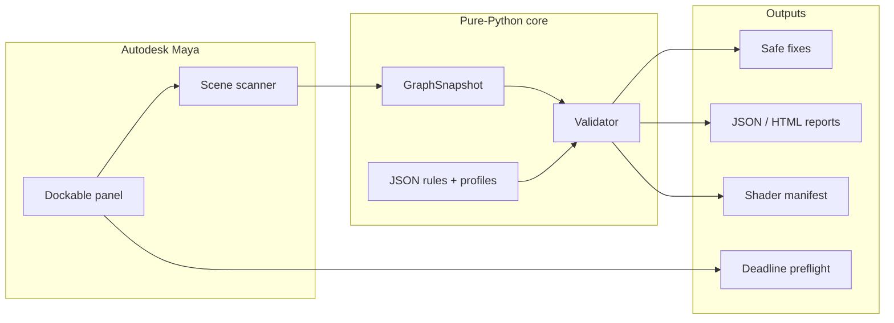

# Maya Pipeline Inspector Wiki

> **Production material & scene QA for Autodesk Maya** · MIT open source · **v0.6.0** shipped  
> Catch missing textures, bad paths, UDIM gaps, color-space mistakes, shader complexity, geometry budgets, and farm blockers **before** publish or Deadline submission.

---

## What is Pipeline Inspector?

**Maya Pipeline Inspector** is a snapshot-first validation framework with a **dockable Maya panel**, **headless CLI**, **JSON rule engine**, **safe auto-fix queue**, **studio settings hub**, and **Deadline / tracker integrations**.

It answers one question:

> **Can this scene be published or sent to the farm safely — and if not, what broke, who fixes it, and can we fix it without destroying references?**

---

## Choose your path

| I am a… | Start here | Time |
| --- | --- | --- |
| **Technical Artist** | [5-minute quick start](Getting-Started/Quick-Start-5-Minutes) → [Validate tab](Panel/Validate-Tab) | ~10 min |
| **Shader TD** | [How rules work](Rules-and-Validation/How-Rules-Work) → [Authoring rules](Rules-and-Validation/Authoring-Rules) | ~30 min |
| **Pipeline TD** | [Installation](Getting-Started/Installation) → [Studio config](Administration/Studio-Config) → [Headless CLI](Workflows/Headless-CLI) | ~1 h |
| **Render supervisor** | [Reports tab](Panel/Reports-Tab) → [Publish preflight](Workflows/Publish-Preflight) → [Capability matrix](Reference/Capability-Matrix) | ~20 min |
| **New to the project** | [Overview](Getting-Started/Overview) → [Architecture](Reference/Architecture-Overview) | ~15 min |

---

## Panel at a glance

Six tabs — one validation pipeline underneath:

| Tab | Purpose |
| --- | --- |
| **Validate** | Scan scene/selection, triage issues, jump to nodes/files |
| **Waivers** | Approve known exceptions with audit trail |
| **Fixes** | Preview and apply safe auto-fixes |
| **Reports** | Export JSON, HTML, manifest, diff, tracker notes |
| **Readiness** | Workstation probes before publish/farm (v0.6) |
| **Farm** | Deadline 10 connection, preflight, submit |
| **Settings** *(gear)* | Roles, studio policy, connectors, bug report |

Deep dive: [Panel overview](Panel/Overview) · Full user guide: [`USER_GUIDE.md`](../USER_GUIDE.md)

---

## Feature highlights (v0.6.0)

| Domain | Highlights |
| --- | --- |
| **Materials & textures** | Missing files, path policy, UDIM, color space, displacement, complexity, farm cost score |
| **Geometry** | Polycount budgets by asset class, duplicate mesh detection |
| **Governance** | Role capabilities, risky-fix gates, supervisor routing ([ADR 0008](../adr/0008-role-based-governance-foundation.md)) |
| **Integrations** | Deadline 10, Telegram/Discord/Slack, Ftrack/ShotGrid/Cerebro, bug-report relay |
| **Operations** | GitHub Release auto-update (module path), 1306+ unit tests |

Honest gaps: [FAQ — known limitations](FAQ-and-Troubleshooting#known-limitations)

---

## Documentation map

| Layer | Wiki | Deep reference |
| --- | --- | --- |
| Install & bootstrap | [Installation](Getting-Started/Installation) | [`MAYA_INSTALL.md`](../MAYA_INSTALL.md) |
| Daily UI workflow | [By role](Workflows/By-Role) | [`USER_GUIDE.md`](../USER_GUIDE.md) |
| Rule packs | [Authoring rules](Rules-and-Validation/Authoring-Rules) | [`RULE_AUTHORING.md`](../RULE_AUTHORING.md) |
| Studio rollout | [Studio config](Administration/Studio-Config) | [`STUDIO_OVERRIDES.md`](../STUDIO_OVERRIDES.md) |
| Integrations | [Integration index](Integrations/Index) | [`docs/integrations/`](../integrations/) |
| System design | [Architecture](Reference/Architecture-Overview) | [`ARCHITECTURE.md`](../ARCHITECTURE.md) |
| CLI & CI | [CLI reference](Reference/CLI-Reference) | [`CLI_TESTING.md`](../CLI_TESTING.md) |
| Snapshot format | — | [`SNAPSHOT_SCHEMA.md`](../SNAPSHOT_SCHEMA.md) |

---

## Tutorials (hands-on)

1. [First validation tutorial](Tutorials/First-Validation-Tutorial) — broken scene → fix → revalidate  
2. [V-Ray policy walkthrough](Tutorials/V-Ray-Policy-Walkthrough) — `examples/vray_policy/`  
3. [Arnold policy walkthrough](Tutorials/Arnold-Policy-Walkthrough) — `examples/arnold_policy/`

---

## Community & releases

- [GitHub Releases](https://github.com/armasonix/maya-pipeline-inspector/releases) · [`CHANGELOG.md`](../../CHANGELOG.md)
- [Report a bug](https://github.com/armasonix/maya-pipeline-inspector/issues) · Panel **Bug Report**
- [`COMMUNITY.md`](../../COMMUNITY.md) · [`CONTRIBUTING.md`](../../CONTRIBUTING.md)

---

*Wiki source lives in `docs/wiki/` in the repository. Product principles: GUI-first ([ADR 0005](../adr/0005-gui-first-product-philosophy.md)), snapshot-first core ([ADR 0001](../adr/0001-snapshot-first-core.md)).*
