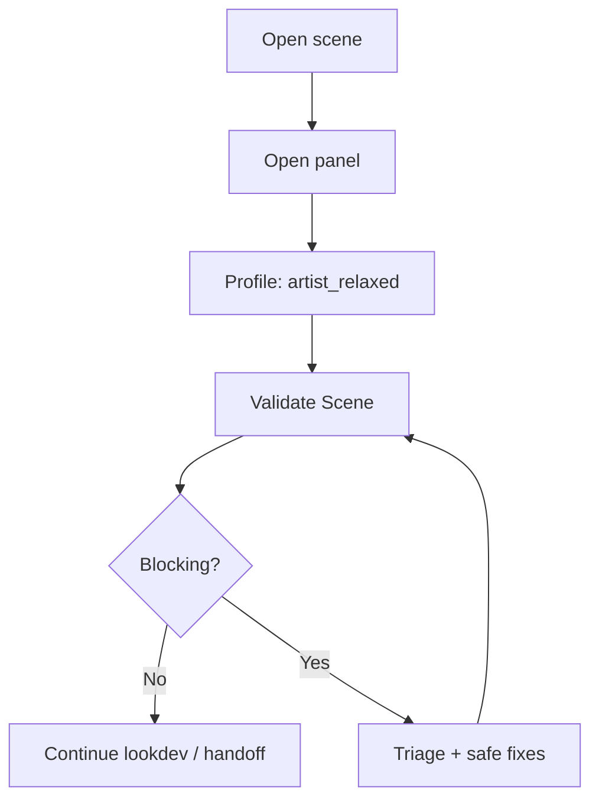

# Workflows by role

Role-based daily paths. All roles share the same validation engine — differences are **profile**, **capabilities**, and **exports**.

## Technical Artist

| Step | Detail |
| --- | --- |
| Profile | `artist_relaxed` daily; switch to `publish_strict` before handoff |
| Fixes | Safe queue only — risky fixes may be denied |
| Farm | Use **Farm Check** when wrangler requests preflight |
| Updates | **Check for Updates** if on module-path install |

→ [Quick start](Quick-Start-5-Minutes)

## Shader TD

| Step | Detail |
| --- | --- |
| Validate | `publish_strict` + asset class overlays |
| Rules | Enable studio rule paths; tune profiles in JSON |
| Authoring | Rule browser, wizard, hand-edited packs |
| Manifest | Export baselines for hero assets |

→ [Authoring rules](Authoring-Rules) · [`RULE_AUTHORING.md`](../../RULE_AUTHORING.md)

## Pipeline TD

| Step | Detail |
| --- | --- |
| Deploy | [`MAYA_INSTALL.md`](../../MAYA_INSTALL.md) + studio JSON on share |
| Headless | Publish hooks: `validate`, `gate`, `apply-fixes` |
| Deadline | Package scripts + [`deadline_submit_preflight.md`](../../integrations/deadline_submit_preflight.md) |
| CI | `pytest` + optional Maya integration runner |

→ [Headless CLI](Headless-CLI) · [Studio config](Studio-Config)

## Render supervisor

| Step | Detail |
| --- | --- |
| Review | HTML report or panel summary |
| Waivers | Approve/revoke with audit |
| Blocking | Trust **Publish Block** / **Deadline Block** flags |
| Trends | Farm analytics CLI for historical view |

→ [Publish preflight](Publish-Preflight) · [`deadline_farm_analytics.md`](../../integrations/deadline_farm_analytics.md)

## Capability matrix (v0.6)

| Action | Typical TA | Shader TD | Pipeline TD | Admin |
| --- | --- | --- | --- | --- |
| Validate | ✓ | ✓ | ✓ | ✓ |
| Safe fixes | ✓ | ✓ | ✓ | ✓ |
| Risky fixes | policy | ✓ | ✓ | ✓ |
| Submit farm | policy | policy | ✓ | ✓ |
| Edit studio config | ✗ | policy | ✓ | ✓ |
| Manage rules | ✗ | ✓ | ✓ | ✓ |

Details: [Governance](Governance)
